# 02_System_Architecture.md
# System Architecture
# Real Time Vessel Tracking System

**Nama Sistem Contoh:** VesselTrack OS  
**Versi Dokumen:** v1.0  
**Tanggal:** 21 Juni 2026  
**Status:** Draft Awal  
**Diturnunkan dari:** `01_PRD.md`  
**Pendekatan Pengembangan:** AIS API Provider → MVP Tracking → Geofence & Alert → Playback & Analytics → Hardening

---

## 1. Ringkasan Arsitektur

**Real Time Vessel Tracking System** adalah sistem pemantauan kapal berbasis peta digital yang menerima data posisi kapal dari **AIS API Provider**, memproses data tersebut melalui ingestion dan validation layer, menyimpannya dalam database geospasial/time-series, lalu menyajikannya ke dashboard real-time melalui REST API dan WebSocket.

Arsitektur awal dirancang dengan prinsip:

1. **API-first**: seluruh fungsi utama diekspos melalui REST API dan WebSocket.
2. **Geospatial-ready**: penyimpanan dan query spasial menggunakan PostgreSQL + PostGIS.
3. **Time-series-ready**: histori posisi kapal disimpan dengan pendekatan time-series melalui TimescaleDB.
4. **Realtime-first**: update posisi kapal dikirim ke frontend melalui WebSocket.
5. **Modular**: ingestion, API, WebSocket, geofence, alert, dan analytics dapat dipisahkan bertahap.
6. **Provider-agnostic**: AIS provider dibungkus dalam data source abstraction layer agar tidak terkunci pada satu vendor.

Arsitektur MVP dibuat cukup ramping, tetapi tetap memiliki jalur evolusi menuju production-grade maritime intelligence platform.

---

## 2. Tujuan Arsitektur

### 2.1 Tujuan Teknis

1. Mengambil data kapal dari AIS API Provider secara periodik atau webhook jika tersedia.
2. Menormalisasi data dari provider menjadi format internal standar.
3. Memvalidasi kualitas data posisi, termasuk koordinat, timestamp, MMSI, dan duplikasi.
4. Menyimpan latest position dan historical position.
5. Menampilkan kapal pada peta real-time.
6. Mengirim update posisi melalui WebSocket.
7. Mendukung geofence statis dan deteksi pelanggaran awal.
8. Mendukung alert feed dan event historis.
9. Menyediakan fondasi untuk playback, analytics, export, dan notifikasi.

### 2.2 Tujuan Operasional

1. Dashboard dapat dipakai operator untuk memantau kapal aktif.
2. Sistem tetap dapat berjalan meskipun provider mengalami keterlambatan sementara.
3. Data sensitif seperti API key tidak terekspos ke frontend.
4. Sistem memiliki logging dan audit trail untuk debugging dan pengawasan.
5. Sistem dapat dikembangkan bertahap tanpa bongkar ulang total.

---

## 3. Prinsip Desain

| Prinsip | Penjelasan |
|---|---|
| Simple First | MVP tidak langsung memakai microservices kompleks jika belum perlu. |
| Modular by Boundary | Setiap domain utama memiliki boundary jelas: ingestion, tracking, geofence, alert, user, analytics. |
| Event-Aware | Data posisi diperlakukan sebagai event yang terus mengalir. |
| Spatial Native | Query lokasi, polygon, bbox, dan geofence menjadi fitur inti, bukan tambahan. |
| Fail Gracefully | Jika provider lambat, dashboard tetap menampilkan last known position dengan status stale. |
| Observable | Setiap proses ingestion, validation, WebSocket, dan alert harus dapat dimonitor. |
| Secure by Default | API key, user session, role, dan audit log dikelola sejak awal. |

---

## 4. Konteks Sistem

### 4.1 Aktor Eksternal

1. **Operator**: memantau kapal, mencari kapal, melihat alert.
2. **Supervisor**: melihat KPI, alert, dan laporan ringkas.
3. **Analyst**: melihat histori, playback, dan export data.
4. **Admin**: mengelola user, role, provider config, geofence, dan rule.
5. **AIS API Provider**: sumber data vessel position.
6. **Base Map Provider**: penyedia tile map.
7. **Notification Gateway**: email, Telegram, WhatsApp gateway pada fase lanjutan.
8. **External System**: sistem internal/mitra yang kelak mengonsumsi API.

### 4.2 System Context Diagram

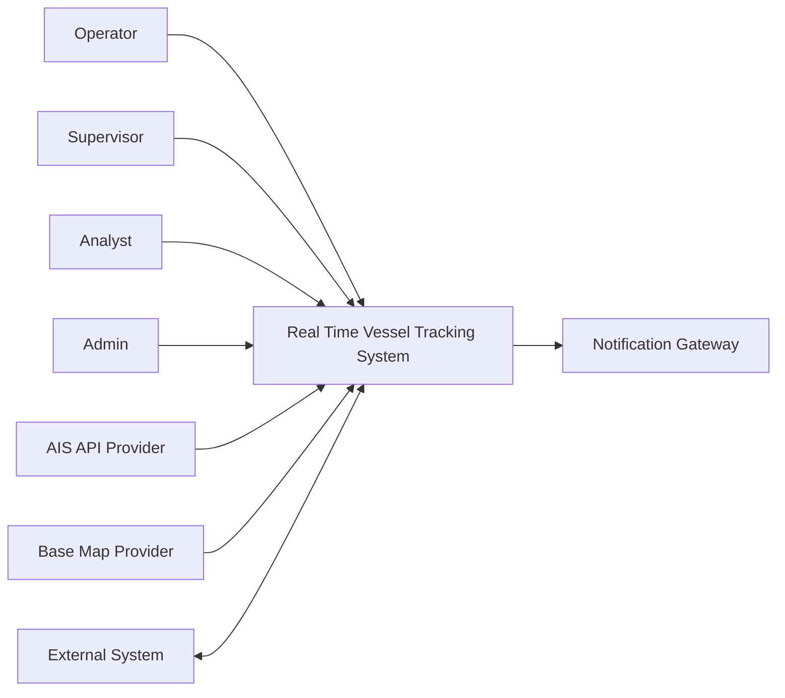

---

## 5. High-Level Architecture

### 5.1 Diagram Arsitektur Tingkat Tinggi

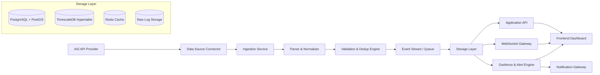

### 5.2 Narasi Alur Utama

1. **AIS API Provider** mengirim atau menyediakan data posisi kapal.
2. **Data Source Connector** mengambil data melalui polling atau webhook.
3. **Ingestion Service** menyimpan raw response dan meneruskan data ke parser.
4. **Parser & Normalizer** mengubah format provider menjadi format internal.
5. **Validation & Dedup Engine** memvalidasi koordinat, timestamp, MMSI, dan duplikasi.
6. **Event Stream / Queue** mendistribusikan event posisi bersih ke consumer lain.
7. **Storage Layer** menyimpan latest position, historical position, vessel master, geofence, alert, dan audit log.
8. **Application API** menyediakan REST API untuk dashboard dan integrasi.
9. **WebSocket Gateway** mengirim update posisi real-time ke frontend.
10. **Geofence & Alert Engine** mengecek event posisi terhadap polygon geofence dan membuat alert.
11. **Frontend Dashboard** menampilkan peta, marker kapal, detail kapal, alert feed, dan playback.

---

## 6. Deployment View

### 6.1 Deployment MVP

Untuk MVP, arsitektur dapat dibuat sebagai beberapa container dalam satu VPS/cloud environment.

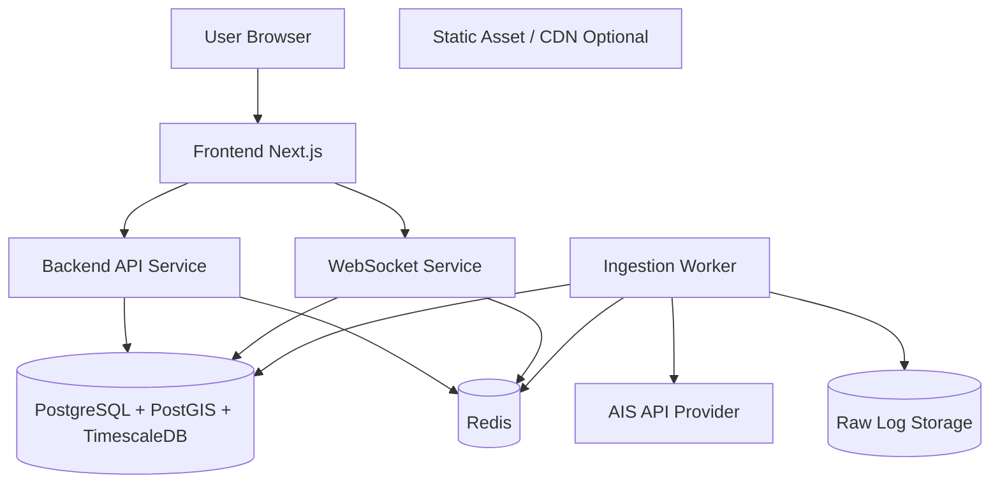

### 6.2 Deployment Production

Pada fase production, komponen dapat dipisahkan menjadi service mandiri.

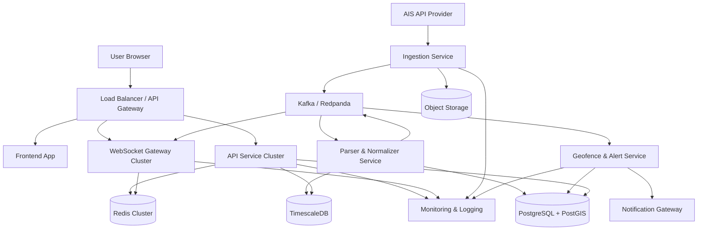

---

## 7. Logical Component Architecture

### 7.1 Komponen Utama

| Komponen | Fungsi Utama | MVP | Production |
|---|---|---:|---:|
| Frontend Dashboard | UI peta, detail kapal, alert, playback | Ya | Ya |
| Backend API Service | REST API untuk vessel, position, geofence, alert | Ya | Ya |
| WebSocket Gateway | Push update posisi dan alert | Ya | Ya |
| Ingestion Service | Ambil data dari AIS API Provider | Ya | Ya |
| Parser & Normalizer | Transformasi data provider ke internal schema | Ya | Ya |
| Validation Engine | Validasi koordinat, timestamp, MMSI, duplikasi | Ya | Ya |
| Storage Layer | Simpan vessel, posisi, geofence, alert, audit | Ya | Ya |
| Geofence Engine | Cek posisi terhadap polygon | Basic | Advanced |
| Alert Engine | Membuat alert rule-based | Basic | Advanced |
| Notification Service | Email/Telegram/WhatsApp | Tidak | Ya |
| Analytics Service | KPI, heatmap, idle, export | Basic | Ya |
| Admin Service | User, role, provider config | Basic | Ya |

### 7.2 Bounded Context

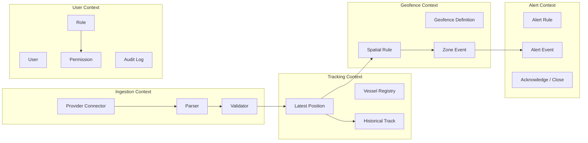

---

## 8. Data Flow Architecture

### 8.1 Real-Time Position Flow

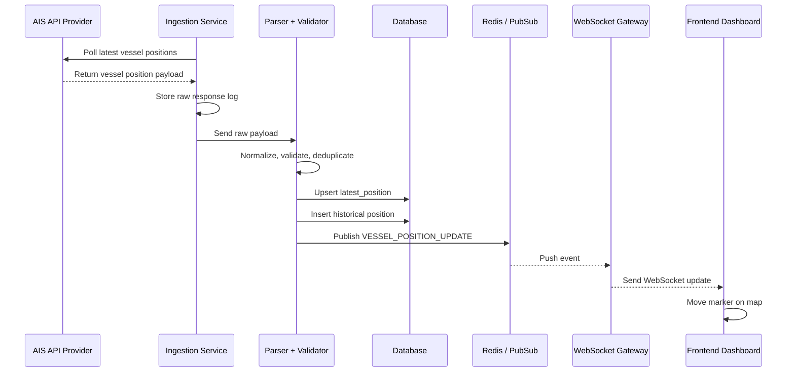

### 8.2 Geofence Alert Flow

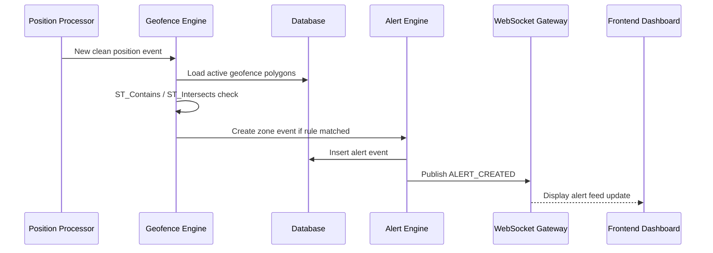

### 8.3 Historical Track Flow

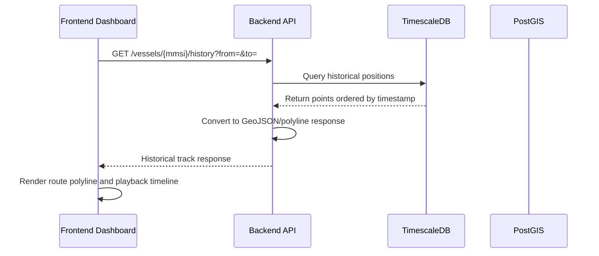

---

## 9. Data Architecture

### 9.1 Database Technology

| Layer | Teknologi | Fungsi |
|---|---|---|
| Relational | PostgreSQL | Vessel master, user, role, alert, config |
| Geospatial | PostGIS | Point, polygon, bbox, geofence query |
| Time-Series | TimescaleDB | Historical vessel positions |
| Cache | Redis | Latest position cache, pub/sub, session, rate-limited data |
| Raw Storage | Object Storage / File Storage | Raw provider payload untuk audit/debug |

### 9.2 Core Entity

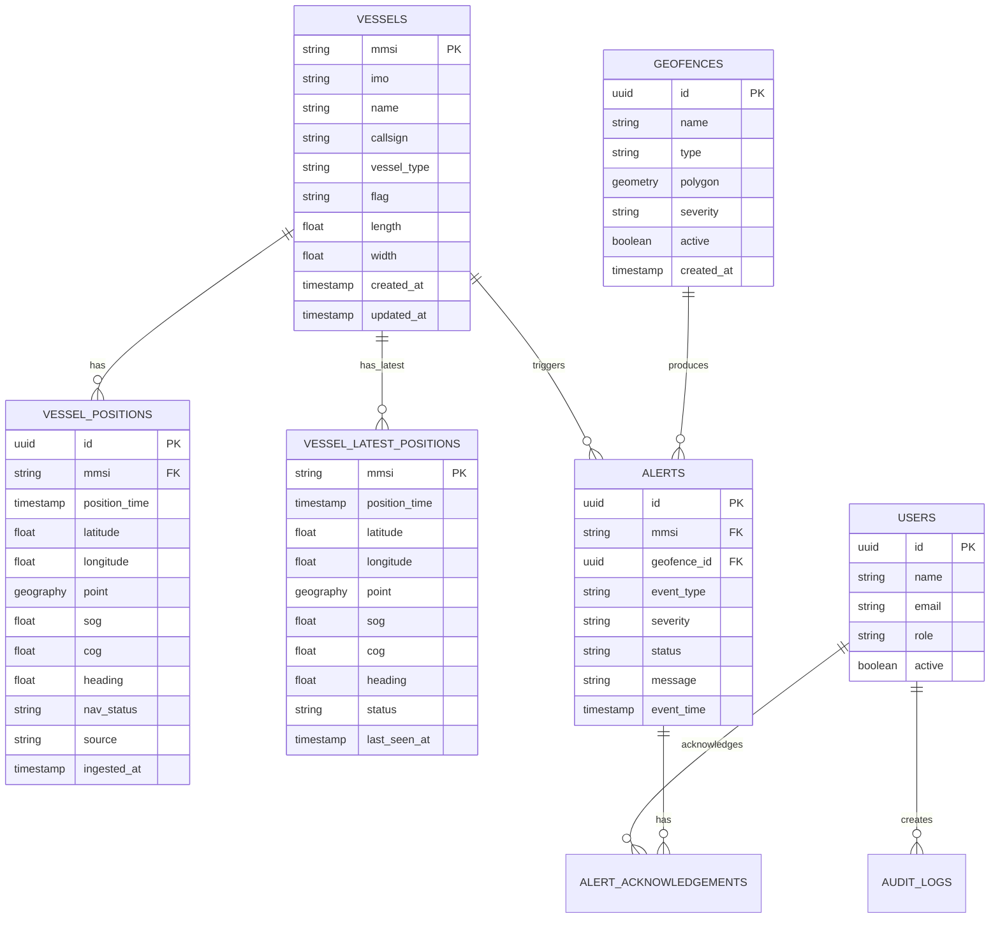

### 9.3 Data Retention Awal

| Data | MVP | Production |
|---|---:|---:|
| Raw provider response | 7 hari | 30-90 hari sesuai kebutuhan |
| Historical position detail | 7-30 hari | 6-24 bulan dengan compression |
| Latest position | Selalu update | Selalu update |
| Alert history | 90 hari | 1-5 tahun sesuai audit |
| Audit log | 90 hari | 1-5 tahun sesuai kebijakan |

---

## 10. API Architecture

### 10.1 REST API Groups

```text
/api/v1/auth
/api/v1/users
/api/v1/vessels
/api/v1/positions
/api/v1/geofences
/api/v1/alerts
/api/v1/playback
/api/v1/analytics
/api/v1/admin/data-sources
/api/v1/audit-logs
```

### 10.2 WebSocket Channels

```text
/ws/vessels
/ws/alerts
/ws/system-status
```

### 10.3 Event Envelope Standard

Semua event WebSocket sebaiknya memakai envelope konsisten.

```json
{
  "event_id": "evt_01J...",
  "type": "VESSEL_POSITION_UPDATE",
  "occurred_at": "2026-06-21T10:15:22Z",
  "source": "ais_provider",
  "payload": {
    "mmsi": "525123456",
    "lat": -6.1122,
    "lon": 106.8847,
    "sog": 12.4,
    "cog": 88.5,
    "heading": 90,
    "status": "under_way"
  }
}
```

### 10.4 Viewport Filtering

Untuk performa dashboard, frontend tidak perlu menerima semua kapal secara mentah. Gunakan pendekatan:

```text
GET /api/v1/positions/bbox?minLon=&minLat=&maxLon=&maxLat=&zoom=&types=&status=
```

Pada fase production, WebSocket juga dapat difilter berdasarkan viewport aktif:

```json
{
  "type": "SUBSCRIBE_VIEWPORT",
  "bbox": {
    "minLon": 106.70,
    "minLat": -6.25,
    "maxLon": 107.05,
    "maxLat": -5.95
  },
  "filters": {
    "vessel_type": ["cargo", "tanker"],
    "status": ["under_way", "in_port"]
  }
}
```

---

## 11. Realtime Architecture

### 11.1 MVP Realtime Pattern

Pada MVP, pola yang cukup:

```text
Ingestion Worker → Redis Pub/Sub → WebSocket Gateway → Browser
```

Kelebihan:

1. Cepat dibuat.
2. Cukup untuk 1.000 kapal aktif.
3. Mudah dioperasikan.
4. Tidak membutuhkan Kafka sejak awal.

### 11.2 Production Realtime Pattern

Pada production:

```text
Ingestion → Kafka/Redpanda → Stream Processor → Redis/WS Gateway → Browser
```

Kelebihan:

1. Lebih tahan beban.
2. Bisa replay event.
3. Consumer dapat dipisah: geofence, analytics, notification, archive.
4. Lebih cocok untuk multi-area dan high-volume tracking.

### 11.3 Event Type Awal

| Event Type | Deskripsi |
|---|---|
| VESSEL_POSITION_UPDATE | Posisi kapal terbaru |
| VESSEL_STATUS_CHANGED | Status kapal berubah, misalnya moving ke stale |
| GEOFENCE_ENTERED | Kapal masuk area geofence |
| GEOFENCE_EXITED | Kapal keluar area geofence, fase lanjutan |
| ALERT_CREATED | Alert baru dibuat |
| ALERT_ACKNOWLEDGED | Alert diakui operator |
| PROVIDER_STATUS_CHANGED | Status provider berubah |

---

## 12. Geospatial Architecture

### 12.1 Representasi Geometri

| Data | Tipe Geometri | Catatan |
|---|---|---|
| Posisi kapal | Point | WGS84 / EPSG:4326 |
| Geofence | Polygon / MultiPolygon | Area pelabuhan, restricted area, anchorage |
| Track historis | LineString / derived polyline | Dibentuk dari kumpulan point |
| BBox query | Envelope | Untuk viewport map |

### 12.2 Operasi Spasial Utama

| Operasi | Fungsi |
|---|---|
| ST_Contains | Mengecek titik kapal di dalam polygon geofence |
| ST_Intersects | Mengecek persinggungan spatial |
| ST_DWithin | Mengecek radius jarak |
| ST_MakePoint | Membuat point dari lon/lat |
| ST_SetSRID | Menetapkan SRID 4326 |
| ST_AsGeoJSON | Mengirim data geometri ke frontend |

### 12.3 Indexing

Index yang direkomendasikan:

```sql
CREATE INDEX idx_vessel_positions_mmsi_time
ON vessel_positions (mmsi, position_time DESC);

CREATE INDEX idx_vessel_positions_geom
ON vessel_positions USING GIST (geom);

CREATE INDEX idx_latest_positions_geom
ON vessel_latest_positions USING GIST (geom);

CREATE INDEX idx_geofences_geom
ON geofences USING GIST (geom);

CREATE INDEX idx_alerts_event_time
ON alerts (event_time DESC);
```

---

## 13. Security Architecture

### 13.1 Authentication

MVP dapat menggunakan:

1. Email + password.
2. JWT access token.
3. Refresh token.
4. Password hashing menggunakan Argon2 atau bcrypt.

Production dapat ditingkatkan ke:

1. SSO / OAuth2 / OIDC.
2. MFA untuk Admin.
3. Session management terpusat.

### 13.2 Authorization

Role awal:

| Role | Hak Akses |
|---|---|
| Admin | Full access, manage user, provider, geofence, rule |
| Supervisor | Dashboard, analytics, acknowledge/close alert |
| Operator | Dashboard, vessel detail, acknowledge alert |
| Analyst | History, playback, analytics, export |
| Viewer | Read-only dashboard |

### 13.3 API Security

1. Semua endpoint menggunakan HTTPS.
2. Semua endpoint membutuhkan autentikasi kecuali health check.
3. API key AIS provider hanya tersimpan di backend secret store.
4. Rate limiting untuk login, search, export, dan public integration API.
5. Audit log untuk login, logout, create/update/delete geofence, update rule, acknowledge alert.
6. WebSocket harus memverifikasi token sebelum menerima subscription.

### 13.4 Data Security

1. Encrypt in transit: HTTPS/WSS.
2. Encrypt at rest: database volume dan object storage.
3. Secret management: `.env` hanya untuk development, secret manager untuk production.
4. Backup database terenkripsi.
5. Data export diberi kontrol permission.

---

## 14. Observability Architecture

### 14.1 Logging

Log minimal:

1. Ingestion success/failure.
2. Provider latency.
3. Jumlah record diterima.
4. Jumlah record valid/invalid/duplicate.
5. WebSocket connected/disconnected.
6. Alert created/acknowledged/closed.
7. Error API dan exception backend.

### 14.2 Metrics

| Metric | Deskripsi |
|---|---|
| provider_request_count | Jumlah request ke AIS provider |
| provider_latency_ms | Latency provider |
| positions_ingested_total | Jumlah posisi masuk |
| positions_valid_total | Jumlah posisi valid |
| positions_duplicate_total | Jumlah posisi duplikat |
| websocket_clients_active | Jumlah client aktif |
| alerts_created_total | Jumlah alert dibuat |
| database_query_latency_ms | Latency query utama |

### 14.3 Health Check

Endpoint minimal:

```text
GET /health
GET /health/db
GET /health/redis
GET /health/provider
```

---

## 15. Performance & Scalability Design

### 15.1 Target MVP

| Target | Nilai |
|---|---:|
| Kapal aktif | Minimal 1.000 kapal |
| Dashboard initial load | Maksimal 5 detik |
| Search response | Maksimal 2 detik |
| Backend-to-frontend update | Maksimal 3 detik setelah data diproses |
| Availability | Minimal 95% |

### 15.2 Strategi Performa

1. Gunakan latest position table agar dashboard tidak query histori setiap saat.
2. Gunakan bbox query untuk hanya mengambil kapal pada viewport aktif.
3. Gunakan Redis cache untuk latest positions yang sering dibaca.
4. Gunakan GIST index untuk query spasial.
5. Gunakan TimescaleDB hypertable untuk historical positions.
6. Gunakan pagination untuk list vessel dan alert.
7. Gunakan marker clustering pada frontend bila jumlah kapal besar.
8. Gunakan delta update melalui WebSocket, bukan reload semua marker.

### 15.3 Strategi Scaling Bertahap

| Fase | Strategi |
|---|---|
| MVP | Monolith modular + worker + Redis + PostGIS |
| Growth | Pisahkan ingestion, API, WebSocket, alert worker |
| Production | Kafka/Redpanda, service cluster, autoscaling, read replica |
| Enterprise | Multi-area, multi-provider, regional deployment, HA database |

---

## 16. Frontend Architecture

### 16.1 Stack Rekomendasi

| Area | Teknologi |
|---|---|
| Framework | Next.js + React |
| UI | Tailwind CSS + component library |
| Map | MapLibre GL untuk MVP modern; Leaflet jika ingin lebih sederhana |
| State | Zustand / Redux Toolkit |
| Realtime | WebSocket client |
| Data Fetching | TanStack Query / SWR |
| Auth | JWT session handler |

### 16.2 Frontend Module

```text
src/
  app/
  components/
    map/
    vessel/
    geofence/
    alert/
    playback/
    dashboard/
  features/
    auth/
    vessels/
    positions/
    geofences/
    alerts/
    analytics/
  services/
    api-client.ts
    websocket-client.ts
  stores/
    map-store.ts
    vessel-store.ts
    alert-store.ts
```

### 16.3 Map Rendering Strategy

1. Initial load mengambil latest position berdasarkan bbox.
2. WebSocket menerima delta update.
3. Marker dipindahkan tanpa reload map.
4. Marker kapal terpilih diberi highlight.
5. Geofence polygon dirender sebagai layer terpisah.
6. Historical track dirender sebagai polyline.
7. Playback memakai time-indexed position array.

---

## 17. Backend Architecture

### 17.1 Stack Rekomendasi

Dua opsi utama:

| Opsi | Kelebihan | Catatan |
|---|---|---|
| FastAPI | Cepat untuk API, kuat untuk data processing Python | Cocok jika analytics/ML akan kuat |
| NestJS | Struktur enterprise, TypeScript end-to-end | Cocok jika tim frontend kuat di TypeScript |

Untuk MVP, pilih salah satu saja. Jangan mencampur dua backend utama sebelum boundary sistem matang.

### 17.2 Backend Module

```text
backend/
  src/
    auth/
    users/
    vessels/
    positions/
    ingestion/
    geofences/
    alerts/
    playback/
    analytics/
    admin/
    audit/
    common/
      config/
      logger/
      database/
      errors/
      security/
```

### 17.3 Service Responsibility

| Service | Tanggung Jawab |
|---|---|
| Auth Service | Login, token, session, permission |
| Vessel Service | Vessel registry, search, detail |
| Position Service | Latest position, history, bbox query |
| Ingestion Service | Pull/push AIS provider data |
| Geofence Service | Polygon, rule, spatial check |
| Alert Service | Alert lifecycle dan feed |
| Playback Service | Menyediakan data rute historis |
| Analytics Service | KPI, aggregate, heatmap awal |
| Audit Service | Mencatat aktivitas penting |

---

## 18. Ingestion Architecture

### 18.1 AIS Provider Abstraction

Agar tidak terkunci vendor, gunakan interface internal:

```text
IAisProviderClient
  - fetchLatestPositions(area, since)
  - fetchVesselDetail(mmsi)
  - getProviderStatus()
  - normalizePayload(rawPayload)
```

### 18.2 Polling Strategy

Untuk MVP:

| Area | Interval Awal |
|---|---:|
| Area padat/pelabuhan | 10-30 detik |
| Area umum | 30-60 detik |
| Kapal favorit/critical | 5-15 detik jika provider dan biaya memungkinkan |

### 18.3 Data Quality Gate

Sebelum data masuk ke storage utama:

1. `mmsi` wajib tersedia.
2. `latitude` harus -90 sampai 90.
3. `longitude` harus -180 sampai 180.
4. `timestamp` wajib tersedia dan tidak terlalu jauh dari waktu ingestion.
5. Duplikasi dicek berdasarkan `mmsi + timestamp + lat + lon`.
6. Posisi loncat diberi flag `suspect`, bukan langsung dibuang.
7. Speed abnormal diberi flag untuk alert/quality review.

---

## 19. Alert & Geofence Architecture

### 19.1 Rule Model Awal

```json
{
  "rule_id": "rule_gf_001",
  "name": "Restricted Area Breach",
  "type": "GEOFENCE_ENTER",
  "geofence_id": "gf_001",
  "severity": "HIGH",
  "enabled": true,
  "debounce_seconds": 60
}
```

### 19.2 Alert State

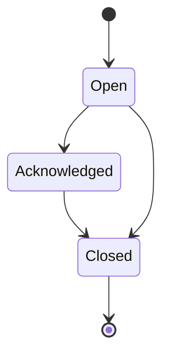

### 19.3 Debounce Strategy

Agar operator tidak dibanjiri alert:

1. Alert geofence yang sama untuk kapal yang sama tidak dibuat ulang dalam `debounce_seconds`.
2. Status kapal terhadap geofence disimpan sebagai state.
3. Event baru dibuat hanya saat terjadi transisi: outside → inside atau inside → outside.

---

## 20. Analytics Architecture

### 20.1 Analytics MVP

KPI awal:

1. Active vessels.
2. Vessels in port.
3. Alerts today.
4. Average speed.
5. Jumlah vessel berdasarkan status.

### 20.2 Analytics Lanjutan

1. Heatmap kepadatan kapal.
2. Idle/anchoring duration.
3. Port call duration.
4. Vessel movement summary.
5. Route deviation.
6. ETA estimation.
7. Export CSV/GeoJSON.

### 20.3 Aggregate Strategy

Untuk production:

1. Gunakan continuous aggregate TimescaleDB.
2. Simpan agregat per 5 menit, 1 jam, dan 1 hari.
3. Pisahkan query analytics berat dari query dashboard real-time.
4. Gunakan read replica untuk reporting jika volume tinggi.

---

## 21. Environment Architecture

### 21.1 Environment

| Environment | Fungsi |
|---|---|
| Local | Development individual |
| Dev | Integrasi awal developer |
| Staging | UAT, simulasi data provider, pre-production |
| Production | Operasional live |

### 21.2 Configuration

Contoh environment variable:

```text
APP_ENV=staging
DATABASE_URL=postgres://...
REDIS_URL=redis://...
AIS_PROVIDER_NAME=provider_x
AIS_PROVIDER_API_URL=https://...
AIS_PROVIDER_API_KEY=***
JWT_SECRET=***
MAP_TILE_URL=https://...
WEBSOCKET_ALLOWED_ORIGINS=https://...
```

---

## 22. Infrastructure Architecture

### 22.1 MVP Infrastructure

```text
1 VPS / Cloud VM / Cloud Run setup
  - Frontend container
  - Backend API container
  - Ingestion worker container
  - WebSocket container
  - PostgreSQL + PostGIS + TimescaleDB
  - Redis
  - Reverse proxy / load balancer
  - Backup job
```

### 22.2 Production Infrastructure

```text
Cloud / Kubernetes / ECS / Cloud Run
  - API service cluster
  - WebSocket gateway cluster
  - Ingestion worker pool
  - Alert worker
  - PostgreSQL managed database
  - TimescaleDB managed/self-hosted
  - Redis managed
  - Object storage
  - Monitoring stack
  - CI/CD pipeline
  - Secret manager
```

---

## 23. CI/CD Architecture

### 23.1 Pipeline Minimum

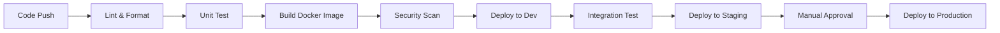

### 23.2 Deployment Rule

1. Migration database harus dijalankan secara terkontrol.
2. Rollback plan tersedia untuk API dan frontend.
3. Secret tidak boleh disimpan dalam repository.
4. Build artifact harus immutable.
5. Deployment production harus melewati staging.

---

## 24. Architecture Decision Record Awal

### ADR-001: Sumber Data Awal Menggunakan AIS API Provider

**Keputusan:** MVP menggunakan AIS API Provider, bukan receiver sendiri.  
**Alasan:** Mempercepat validasi produk dan mengurangi kompleksitas hardware.  
**Konsekuensi:** Perlu abstraksi provider untuk menghindari vendor lock-in.

### ADR-002: Database Menggunakan PostgreSQL + PostGIS + TimescaleDB

**Keputusan:** Storage utama memakai PostgreSQL + PostGIS dan TimescaleDB.  
**Alasan:** Mendukung data relasional, geospasial, dan time-series dalam satu ekosistem.  
**Konsekuensi:** Tim perlu memahami indexing spasial dan hypertable.

### ADR-003: Realtime MVP Menggunakan WebSocket + Redis Pub/Sub

**Keputusan:** MVP menggunakan WebSocket dan Redis Pub/Sub.  
**Alasan:** Lebih sederhana dibanding Kafka untuk tahap awal.  
**Konsekuensi:** Untuk skala besar perlu migrasi ke Kafka/Redpanda.

### ADR-004: Frontend Web Desktop First

**Keputusan:** MVP difokuskan untuk desktop browser.  
**Alasan:** Operator membutuhkan layar besar untuk peta dan panel monitoring.  
**Konsekuensi:** Mobile native tidak masuk MVP.

### ADR-005: Map Engine Menggunakan MapLibre GL atau Leaflet

**Keputusan:** Map engine MVP menggunakan MapLibre GL atau Leaflet.  
**Alasan:** Keduanya cukup matang untuk peta interaktif. MapLibre lebih kuat untuk tampilan modern, Leaflet lebih sederhana.  
**Konsekuensi:** Pemilihan final bergantung pada kebutuhan performa marker dan style peta.

---

## 25. Risiko Arsitektur dan Mitigasi

| Risiko | Dampak | Mitigasi Arsitektur |
|---|---|---|
| Vendor AIS lambat/mahal | Sistem tidak real-time atau biaya tinggi | Provider abstraction, caching, interval adaptif |
| Terlalu banyak marker di map | Browser lambat | BBox filtering, clustering, vector layer, delta update |
| Data posisi duplikat | Track kacau | Dedup engine sebelum insert |
| Posisi loncat | Playback tidak akurat | Data quality flag, speed/distance validation |
| Query history lambat | Playback lambat | TimescaleDB hypertable, index mmsi-time, retention/compression |
| Alert terlalu banyak | Operator lelah | Debounce, state transition, severity threshold |
| API key bocor | Risiko keamanan/vendor | Secret manager, backend-only provider access |
| Database membengkak | Biaya dan performa turun | Retention policy, compression, archive |
| WebSocket overload | Dashboard tidak stabil | Channel filtering, viewport subscription, scale gateway |

---

## 26. Traceability PRD ke Arsitektur

| PRD Requirement | Dukungan Arsitektur |
|---|---|
| FR-001 sampai FR-005 Data Source | AIS Provider Connector + Ingestion Service + Raw Log Storage |
| FR-006 sampai FR-009 Vessel Registry | Vessel Service + PostgreSQL vessel master |
| FR-010 sampai FR-015 Real-Time Tracking | Latest Position, WebSocket Gateway, Redis Pub/Sub |
| FR-016 sampai FR-021 Map Dashboard | Frontend Map Module + Position API + WebSocket |
| FR-022 sampai FR-025 Historical Track | TimescaleDB + History API + GeoJSON response |
| FR-026 sampai FR-031 Geofence | PostGIS polygon + Geofence Engine |
| FR-032 sampai FR-036 Alert | Alert Engine + Alert API + WebSocket Alert Event |
| FR-037 sampai FR-040 Playback | Playback Service + Historical Position Query |
| FR-041 sampai FR-046 Analytics | Analytics Service + aggregate query |
| FR-047 sampai FR-050 User & Role | Auth Service + RBAC + Audit Log |
| NFR Performance | Latest table, cache, bbox filtering, index |
| NFR Security | HTTPS/WSS, JWT, RBAC, secret management |
| NFR Scalability | Modular service boundary + stream-ready architecture |
| NFR Data Quality | Validator + dedup + stale/suspect flag |

---

## 27. Minimum Technical Backlog dari Arsitektur

### 27.1 Foundation

1. Setup repository frontend dan backend.
2. Setup Docker Compose untuk backend, frontend, PostgreSQL/PostGIS/TimescaleDB, Redis.
3. Setup database migration.
4. Setup environment configuration.
5. Setup logging dasar.

### 27.2 Ingestion

1. Buat AIS provider interface.
2. Buat connector dummy/simulator.
3. Buat connector ke provider aktual setelah dipilih.
4. Buat parser dan normalizer.
5. Buat validator dan dedup.
6. Simpan raw log dan clean position.

### 27.3 Tracking

1. Buat schema vessels.
2. Buat schema vessel_positions.
3. Buat schema vessel_latest_positions.
4. Buat endpoint latest positions.
5. Buat endpoint vessel detail.
6. Buat endpoint history.

### 27.4 Realtime

1. Setup Redis Pub/Sub.
2. Setup WebSocket gateway.
3. Broadcast vessel position update.
4. Broadcast alert update.
5. Tambahkan reconnect strategy frontend.

### 27.5 Geofence & Alert

1. Buat schema geofence.
2. Buat static geofence loader.
3. Implement ST_Contains check.
4. Buat alert table.
5. Buat alert feed API.
6. Buat acknowledge alert API.

### 27.6 Frontend

1. Buat dashboard layout.
2. Integrasi peta.
3. Render vessel marker.
4. Integrasi WebSocket update.
5. Buat vessel detail panel.
6. Buat alert feed.
7. Render geofence layer.
8. Buat basic history route.

---

## 28. Rekomendasi Stack Final untuk MVP

Rekomendasi paling praktis untuk MVP:

| Komponen | Pilihan Utama |
|---|---|
| Frontend | Next.js + React + Tailwind CSS |
| Map | MapLibre GL |
| Backend | NestJS jika ingin TypeScript end-to-end; FastAPI jika ingin Python/data-friendly |
| Database | PostgreSQL + PostGIS + TimescaleDB |
| Cache / PubSub | Redis |
| Realtime | WebSocket |
| Deployment | Docker Compose di VPS/Cloud VM untuk awal |
| Monitoring | Basic log + Prometheus/Grafana pada fase hardening |
| Data Source | AIS API Provider |

Catatan keputusan: bila tim pengembang kecil dan ingin seragam dengan frontend, **NestJS + Next.js** memberi pengalaman TypeScript end-to-end. Bila fokus masa depan sangat kuat ke analytics/ML, **FastAPI** bisa lebih nyaman.

---

## 29. Kesimpulan

Arsitektur **Real Time Vessel Tracking System** dirancang sebagai sistem modular yang dimulai dari jalur paling cepat dan realistis: **AIS API Provider → Ingestion → PostGIS/TimescaleDB → REST API/WebSocket → Map Dashboard**.

MVP dapat dibangun dengan monolith modular dan worker sederhana, tetapi boundary sistem sudah disiapkan agar mudah tumbuh menjadi platform production dengan stream processing, geofence engine yang lebih kuat, alerting, analytics, notification gateway, dan integrasi eksternal.

Arsitektur ini menjaga keseimbangan antara kecepatan pembangunan dan ketahanan jangka panjang: cukup ringan untuk mulai berlayar, cukup kuat untuk tidak tenggelam ketika data mulai berombak.

