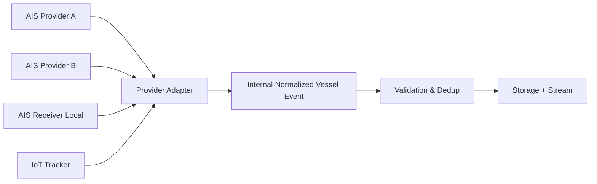
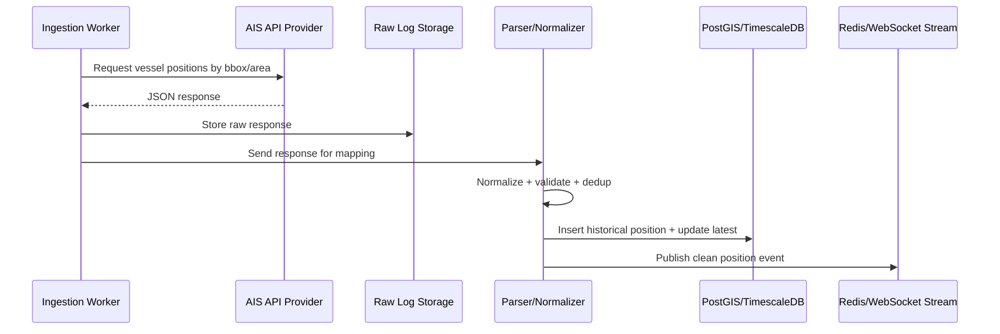

# 03_Data_Source_Strategy.md
# Data Source Strategy
# Real Time Vessel Tracking System

**Nama Sistem Contoh:** VesselTrack OS  
**Versi Dokumen:** v1.0  
**Tanggal:** 21 Juni 2026  
**Status:** Draft Awal  
**Diturnunkan dari:** `01_PRD.md` dan `02_System_Architecture.md`  
**Pendekatan Pengembangan:** AIS API Provider → MVP Tracking → Geofence & Alert → Playback & Analytics → Hardening

---

## 1. Ringkasan Eksekutif

Dokumen ini menjelaskan strategi sumber data untuk **Real Time Vessel Tracking System**. Berdasarkan PRD dan arsitektur sistem, jalur terbaik untuk pengembangan awal adalah menggunakan **AIS API Provider** sebagai sumber data utama. Pendekatan ini dipilih agar tim dapat fokus membangun nilai produk: dashboard real-time, vessel detail, histori posisi, geofence, alert, dan playback, tanpa tersendat oleh kompleksitas pembangunan infrastruktur AIS receiver fisik sejak awal.

Strategi sumber data dirancang dalam tiga tahap:

1. **MVP Source Strategy**: menggunakan AIS API Provider sebagai sumber utama.
2. **Hybrid Source Strategy**: menggabungkan AIS API Provider dengan AIS receiver lokal atau GPS/IoT tracker untuk area operasi penting.
3. **Maritime Intelligence Source Strategy**: memperkaya data dengan port data, weather, bathymetry, route plan, asset registry, dan data operasional internal.

Prinsip utamanya adalah **provider-agnostic**, yaitu sistem tidak terkunci pada satu vendor. Semua data eksternal harus melewati **Data Source Abstraction Layer**, lalu dinormalisasi ke dalam format internal VesselTrack OS.

---

## 2. Tujuan Dokumen

Dokumen ini bertujuan untuk:

1. Menentukan strategi pemilihan sumber data untuk MVP dan fase lanjutan.
2. Menjelaskan jenis sumber data yang dapat digunakan sistem.
3. Menentukan prioritas integrasi data.
4. Menentukan kriteria evaluasi AIS API Provider.
5. Menentukan format data internal standar.
6. Menentukan strategi kualitas data, latency, coverage, dan fallback.
7. Menentukan risiko data source dan mitigasinya.
8. Menjadi acuan bagi dokumen berikutnya, khususnya:
   - `04_AIS_Data_Model.md`
   - `06_API_Specification.md`
   - `07_Realtime_WebSocket_Spec.md`
   - `08_Geofence_Rule_Spec.md`
   - `13_Testing_Strategy.md`

---

## 3. Prinsip Strategi Sumber Data

| Prinsip | Penjelasan |
|---|---|
| API Provider First | MVP menggunakan AIS API Provider agar pengembangan cepat dan risiko teknis lebih rendah. |
| Provider-Agnostic | Sistem harus dapat berganti provider tanpa mengubah core application. |
| Normalize Early | Data dari provider harus segera diubah ke format internal standar. |
| Store Raw & Clean | Raw response disimpan untuk audit/debug, sedangkan data bersih disimpan untuk aplikasi. |
| Geospatial-Ready | Semua posisi kapal harus memiliki representasi geometri/spasial. |
| Quality-Aware | Data tidak diasumsikan selalu benar; perlu validasi, deduplikasi, dan scoring. |
| Latency-Aware | Sistem harus membedakan data real-time, delayed, stale, dan offline. |
| Cost-Controlled | Pengambilan data harus memperhatikan rate limit, area filter, dan biaya vendor. |
| Expandable | Desain harus siap menambah AIS receiver lokal, GPS tracker, weather, port, dan data internal. |

---

## 4. Scope Strategi Data Source

### 4.1 Dalam Scope MVP

Untuk MVP, sumber data yang masuk scope adalah:

1. AIS API Provider sebagai sumber utama.
2. Base map provider untuk tampilan peta.
3. Manual configuration untuk area monitoring/geofence.
4. Internal vessel registry sederhana.
5. Raw data logging dari provider.
6. Latest position dan historical position.

### 4.2 Dalam Scope Fase Lanjutan

Untuk fase lanjutan, sumber data yang dapat ditambahkan adalah:

1. AIS receiver lokal.
2. GPS/IoT tracker untuk kapal internal.
3. Weather API.
4. Port/terminal operational data.
5. Route plan/voyage plan.
6. Bathymetry atau nautical chart layer.
7. Internal asset registry.
8. Notification gateway.
9. External partner API.
10. Historical AIS archive.

### 4.3 Di Luar Scope MVP

Untuk MVP, berikut tidak menjadi prioritas:

1. Integrasi radar.
2. Direct satellite AIS feed tanpa provider.
3. Machine learning untuk dark vessel detection.
4. Collision prediction tingkat lanjut.
5. Full maritime chart compliance untuk navigasi resmi.
6. Multi-provider reconciliation kompleks.

---

## 5. Kategori Sumber Data

### 5.1 AIS API Provider

AIS API Provider adalah sumber data utama pada MVP. Provider menyediakan data posisi kapal dalam bentuk API, biasanya JSON, dengan opsi endpoint real-time, historical, vessel detail, port call, dan voyage data tergantung paket layanan.

Contoh data yang diharapkan:

```json
{
  "mmsi": "525123456",
  "imo": "9876543",
  "name": "MV MUSI JAYA",
  "lat": -6.1012,
  "lon": 106.8804,
  "sog": 12.4,
  "cog": 88.5,
  "heading": 90,
  "nav_status": "under_way",
  "timestamp": "2026-06-21T10:15:22Z"
}
```

Peran dalam sistem:

1. Menyediakan posisi kapal.
2. Menyediakan metadata kapal.
3. Menjadi sumber latest vessel position.
4. Menjadi input untuk historical track.
5. Menjadi input geofence dan alert engine.

### 5.2 AIS Receiver Lokal

AIS receiver lokal adalah sumber data yang menerima sinyal AIS langsung dari kapal melalui perangkat radio/VHF. Ini belum menjadi bagian dari MVP, tetapi disiapkan sebagai opsi fase lanjutan.

Peran dalam sistem:

1. Memperkuat coverage area lokal.
2. Mengurangi ketergantungan total pada provider.
3. Memberikan latency lebih rendah di area operasi tertentu.
4. Menjadi fallback jika API provider terlambat.

Keterbatasan:

1. Butuh perangkat fisik.
2. Butuh antena dan lokasi pemasangan.
3. Coverage terbatas line-of-sight.
4. Butuh parser NMEA/AIVDM.
5. Butuh monitoring perangkat.

### 5.3 GPS / IoT Tracker

GPS/IoT tracker digunakan untuk kapal milik sendiri atau armada yang dapat dipasangi perangkat. Ini berguna jika AIS tidak tersedia, dimatikan, atau tidak cukup akurat untuk kebutuhan operasional internal.

Peran dalam sistem:

1. Tracking kapal internal.
2. Fallback posisi saat AIS silence.
3. Data operasional tambahan seperti battery, device health, dan interval update.
4. Integrasi ke fleet management.

### 5.4 Base Map Provider

Base map provider menyediakan tile map untuk dashboard. Pilihan dapat berupa OpenStreetMap, MapTiler, Mapbox, ArcGIS, atau provider lain.

Kriteria utama:

1. Stabil untuk area operasi.
2. Mendukung zoom level yang cukup.
3. Memiliki lisensi yang sesuai.
4. Mendukung layer laut/pelabuhan jika tersedia.
5. Memiliki performa baik di browser.

### 5.5 Geofence Configuration

Geofence pada MVP dapat dibuat secara manual melalui konfigurasi awal atau seed data. Pada fase lanjutan, geofence dibuat melalui editor UI.

Jenis geofence:

1. Area terbatas.
2. Area pelabuhan.
3. Anchorage area.
4. Channel/jalur pelayaran.
5. Area dangkal/perairan sensitif.
6. Area operasi perusahaan.

### 5.6 Internal Vessel Registry

Internal vessel registry menyimpan master kapal yang relevan dengan sistem. Data ini dapat berasal dari provider, input manual, atau integrasi sistem internal.

Data minimal:

1. MMSI.
2. IMO.
3. Nama kapal.
4. Callsign.
5. Tipe kapal.
6. Flag.
7. Panjang/lebar kapal.
8. Status internal, jika kapal milik perusahaan/mitra.

---

## 6. Prioritas Sumber Data per Fase

### 6.1 Fase 1: MVP Tracking

| Prioritas | Sumber Data | Status | Tujuan |
|---:|---|---|---|
| P0 | AIS API Provider | Wajib | Real-time vessel map dan latest position |
| P0 | Base Map Provider | Wajib | Visualisasi peta |
| P0 | Manual Geofence Seed | Wajib ringan | Basic geofence display |
| P1 | Vessel Registry Provider | Disarankan | Vessel detail |
| P1 | Raw Provider Response | Wajib | Audit/debug |
| P2 | Historical Endpoint | Opsional | Backfill track history |

### 6.2 Fase 2: Geofence & Alert

| Prioritas | Sumber Data | Status | Tujuan |
|---:|---|---|---|
| P0 | AIS Position Stream | Wajib | Deteksi enter/exit geofence |
| P0 | Geofence Polygon | Wajib | Spatial rule |
| P1 | Vessel Type Metadata | Disarankan | Rule berdasarkan tipe kapal |
| P1 | Notification Gateway | Disarankan | Alert eksternal |
| P2 | AIS Receiver Lokal | Opsional | Coverage lokal |

### 6.3 Fase 3: Playback & Analytics

| Prioritas | Sumber Data | Status | Tujuan |
|---:|---|---|---|
| P0 | Historical Position | Wajib | Playback route |
| P1 | Historical AIS API | Disarankan | Backfill data |
| P1 | Vessel Metadata | Disarankan | Filter analytics |
| P2 | Weather API | Opsional | Konteks analitik |
| P2 | Port Operation Data | Opsional | Port call dan dwelling time |

### 6.4 Fase 4: Hardening & Intelligence

| Prioritas | Sumber Data | Status | Tujuan |
|---:|---|---|---|
| P1 | Multi AIS Provider | Disarankan | Redundansi dan coverage |
| P1 | AIS Receiver Lokal | Disarankan | Low-latency local tracking |
| P1 | GPS/IoT Tracker | Disarankan | Fleet-owned tracking |
| P2 | Nautical Layer | Opsional | Analitik area laut |
| P2 | Route Plan | Opsional | Route deviation |

---

## 7. Strategi Pemilihan AIS API Provider

### 7.1 Kriteria Utama

AIS API Provider harus dievaluasi berdasarkan kriteria berikut:

| Kriteria | Pertanyaan Evaluasi | Prioritas |
|---|---|---:|
| Coverage Area | Apakah mencakup area pelabuhan/sungai/laut target? | P0 |
| Latency | Seberapa cepat data posisi tersedia? | P0 |
| Update Frequency | Berapa interval update posisi? | P0 |
| API Quality | Apakah dokumentasi jelas, stabil, dan mudah dipakai? | P0 |
| Rate Limit | Apakah limit cukup untuk kebutuhan dashboard? | P0 |
| Historical Data | Apakah menyediakan data historis/backfill? | P1 |
| Vessel Metadata | Apakah menyediakan IMO, name, type, flag, dimension? | P1 |
| Webhook/Stream | Apakah mendukung push update? | P1 |
| Pricing | Apakah biaya sesuai skala MVP? | P0 |
| License | Apakah data boleh disimpan dan ditampilkan ulang? | P0 |
| SLA | Apakah ada SLA uptime dan support? | P1 |
| Export Rights | Apakah data boleh diekspor ke CSV/GeoJSON? | P1 |
| Multi-Region | Apakah bisa diperluas ke area lain? | P2 |

### 7.2 Provider Evaluation Scorecard

Gunakan score 1–5 untuk setiap kriteria.

| Kriteria | Bobot | Provider A | Provider B | Provider C | Catatan |
|---|---:|---:|---:|---:|---|
| Coverage area target | 20% |  |  |  |  |
| Latency | 15% |  |  |  |  |
| Update frequency | 10% |  |  |  |  |
| API documentation | 10% |  |  |  |  |
| Rate limit | 10% |  |  |  |  |
| Historical data | 10% |  |  |  |  |
| Vessel metadata | 10% |  |  |  |  |
| Pricing | 10% |  |  |  |  |
| License/data rights | 5% |  |  |  |  |
| **Total** | **100%** |  |  |  |  |

### 7.3 Rekomendasi Keputusan

Untuk MVP, pilih provider yang memenuhi minimal:

1. Coverage area target tersedia.
2. Latency cukup untuk dashboard operasional.
3. API mudah digunakan.
4. Rate limit cukup untuk polling area monitoring.
5. Lisensi mengizinkan penyimpanan latest dan historical position.
6. Biaya masih masuk skenario eksperimen/MVP.

Jika terdapat dua provider yang sama kuat, pilih yang paling mudah diintegrasikan untuk MVP, lalu tetap simpan opsi provider kedua sebagai kandidat fallback di fase hardening.

---

## 8. Data Source Abstraction Layer

### 8.1 Tujuan

Data Source Abstraction Layer bertujuan agar aplikasi tidak bergantung langsung pada struktur API vendor tertentu. Semua provider harus diterjemahkan ke format internal yang sama.



### 8.2 Komponen Adapter

Setiap provider memiliki adapter sendiri.

```text
/data-sources
  /ais-provider-a
    connector.ts
    mapper.ts
    auth.ts
    client.ts
  /ais-provider-b
    connector.ts
    mapper.ts
    auth.ts
    client.ts
  /local-ais-receiver
    nmea-reader.ts
    decoder.ts
    mapper.ts
```

### 8.3 Tanggung Jawab Adapter

1. Mengelola authentication provider.
2. Mengambil data via polling/webhook/stream.
3. Mengubah field provider ke field internal.
4. Menangani error provider.
5. Mencatat raw response.
6. Menambahkan metadata sumber data.
7. Meneruskan data ke validation layer.

---

## 9. Format Data Internal Standar

### 9.1 Internal Vessel Position Event

Semua sumber data harus dinormalisasi ke format berikut.

```json
{
  "event_id": "evt_20260621_101522_525123456",
  "source": "ais_api_provider",
  "source_provider": "provider_name",
  "source_message_id": "provider-message-id",
  "mmsi": "525123456",
  "imo": "9876543",
  "vessel_name": "MV MUSI JAYA",
  "callsign": "YB1234",
  "vessel_type": "cargo",
  "flag": "ID",
  "position": {
    "lat": -6.1012,
    "lon": 106.8804
  },
  "sog": 12.4,
  "cog": 88.5,
  "heading": 90,
  "rot": null,
  "nav_status": "under_way",
  "destination": "TANJUNG PRIOK",
  "eta": "2026-06-21T13:45:00Z",
  "position_timestamp": "2026-06-21T10:15:22Z",
  "received_at": "2026-06-21T10:15:25Z",
  "quality": {
    "is_valid": true,
    "is_duplicate": false,
    "is_stale": false,
    "quality_score": 92,
    "issues": []
  }
}
```

### 9.2 Field Wajib MVP

| Field | Wajib | Keterangan |
|---|---:|---|
| mmsi | Ya | Identifier utama kapal |
| lat | Ya | Latitude WGS84 |
| lon | Ya | Longitude WGS84 |
| position_timestamp | Ya | Waktu posisi dari sumber data |
| received_at | Ya | Waktu data diterima sistem |
| sog | Disarankan | Speed over ground |
| cog | Disarankan | Course over ground |
| heading | Opsional | Heading kapal |
| nav_status | Opsional | Status navigasi |
| vessel_name | Opsional | Nama kapal |
| vessel_type | Opsional | Tipe kapal |
| source_provider | Ya | Nama provider/sumber |

### 9.3 Standardisasi Nilai

| Field | Standardisasi |
|---|---|
| Coordinate | WGS84 EPSG:4326 |
| Timestamp | UTC ISO 8601 |
| Speed | Knot |
| Heading/COG | Degree 0–359 |
| MMSI | String numeric 9 digit jika tersedia |
| IMO | String numeric jika tersedia |
| Source | Enum internal |

---

## 10. Strategi Ingestion

### 10.1 Mode Polling

Untuk MVP, mode utama adalah polling API provider.

Contoh interval:

| Area | Interval Polling | Catatan |
|---|---:|---|
| Area kecil/pelabuhan | 10–30 detik | Cocok untuk dashboard real-time ringan |
| Area regional | 30–60 detik | Lebih hemat rate limit |
| Historical backfill | Batch terjadwal | Di luar jalur real-time |

Alur polling:



### 10.2 Mode Webhook

Jika provider mendukung webhook, sistem dapat menerima data push.

Kelebihan:

1. Latency lebih rendah.
2. Lebih hemat request.
3. Lebih cocok untuk event-driven architecture.

Kekurangan:

1. Perlu endpoint publik yang aman.
2. Perlu signature verification.
3. Perlu retry dan idempotency.
4. Tidak semua provider mendukung webhook.

### 10.3 Mode Streaming

Pada fase production, jika provider mendukung streaming atau feed kontinu, sistem dapat menerima data melalui stream.

Kelebihan:

1. Paling dekat dengan real-time.
2. Cocok untuk volume besar.
3. Mudah masuk ke Kafka/Redpanda.

Kekurangan:

1. Kompleksitas lebih tinggi.
2. Butuh monitoring koneksi.
3. Butuh backpressure handling.

---

## 11. Strategi Area Filtering

Untuk mengontrol biaya, rate limit, dan performa, ingestion tidak boleh mengambil seluruh dunia jika kebutuhan hanya area tertentu.

### 11.1 Metode Filter

1. **Bounding box**: area persegi sederhana.
2. **Polygon/geofence**: area presisi, jika provider mendukung.
3. **Port area**: berdasarkan port identifier provider.
4. **Vessel list**: daftar MMSI/IMO tertentu.
5. **Hybrid**: bbox + vessel whitelist.

### 11.2 MVP Recommendation

Untuk MVP, gunakan:

```text
Primary filter   : bounding box area operasi
Secondary filter : vessel type atau MMSI watchlist jika tersedia
Internal filter  : geofence polygon di database PostGIS
```

### 11.3 Contoh Area Configuration

```json
{
  "area_id": "area_tanjung_priok",
  "name": "Tanjung Priok Monitoring Area",
  "bbox": {
    "min_lat": -6.1800,
    "min_lon": 106.8000,
    "max_lat": -5.9800,
    "max_lon": 107.0200
  },
  "polling_interval_seconds": 15,
  "enabled": true
}
```

---

## 12. Strategi Kualitas Data

### 12.1 Validasi Dasar

Setiap position event harus melewati validasi berikut:

| Validasi | Rule |
|---|---|
| MMSI | Tidak kosong, numeric jika memungkinkan |
| Latitude | -90 sampai 90 |
| Longitude | -180 sampai 180 |
| Timestamp | Tidak kosong, tidak terlalu jauh di masa depan |
| SOG | Tidak negatif |
| COG | 0 sampai 360 jika tersedia |
| Heading | 0 sampai 360 jika tersedia |
| Duplicate | Kombinasi MMSI + timestamp + coordinate |
| Stale Data | Waktu posisi lebih tua dari threshold |

### 12.2 Deteksi Data Loncat

Data loncat terjadi ketika posisi kapal berpindah terlalu jauh dalam waktu terlalu pendek.

Rule awal:

```text
Jika jarak posisi baru terhadap posisi terakhir menghasilkan implied speed > MaxAllowedSpeed,
maka tandai sebagai suspicious_position_jump.
```

Contoh threshold awal:

| Tipe Kapal | Max Allowed Speed |
|---|---:|
| Tug / small vessel | 35 kn |
| Cargo | 40 kn |
| Tanker | 35 kn |
| Passenger | 50 kn |
| Unknown | 60 kn |

### 12.3 Quality Score

Setiap event diberi quality score 0–100.

| Kondisi | Pengurangan Score |
|---|---:|
| Missing vessel name | -5 |
| Missing SOG | -5 |
| Missing COG | -5 |
| Stale > threshold | -20 |
| Duplicate | -30 |
| Position jump suspicious | -40 |
| Invalid coordinate | Event ditolak |
| Missing MMSI | Event ditolak |

### 12.4 Status Data

| Status | Definisi |
|---|---|
| realtime | Data terbaru masih dalam threshold real-time |
| delayed | Data agak terlambat, tetapi masih layak tampil |
| stale | Data terlalu lama, tampil sebagai outdated |
| offline | Tidak ada update melewati threshold offline |
| invalid | Data gagal validasi |

Contoh threshold MVP:

| Status | Threshold |
|---|---:|
| realtime | <= 2 menit |
| delayed | > 2 menit sampai 10 menit |
| stale | > 10 menit sampai 30 menit |
| offline | > 30 menit |

---

## 13. Strategi Deduplication

### 13.1 Dedup Key

Deduplication dilakukan dengan kombinasi:

```text
source_provider + mmsi + position_timestamp + lat + lon
```

Jika provider memiliki message id, gunakan:

```text
source_provider + source_message_id
```

### 13.2 Idempotency

Ingestion harus idempotent. Jika data yang sama masuk dua kali, sistem tidak boleh membuat duplikasi historical position atau alert ganda.

Strategi:

1. Gunakan unique constraint pada database.
2. Gunakan Redis short-lived dedup key.
3. Gunakan event hash.
4. Tandai duplicate di raw log untuk audit.

---

## 14. Strategi Latency

### 14.1 Definisi Latency

Ada dua jenis latency:

1. **Source latency**: selisih antara `position_timestamp` dan `received_at`.
2. **Dashboard latency**: selisih antara `received_at` dan waktu data tampil di dashboard.

### 14.2 Target MVP

| Metrik | Target MVP |
|---|---:|
| Polling interval | 10–30 detik |
| Source latency acceptable | <= 2 menit |
| Dashboard delivery after received | <= 3 detik |
| WebSocket publish delay | <= 1 detik internal |
| Latest position query | <= 500 ms untuk area MVP |

### 14.3 UI Treatment

Dashboard harus menampilkan status waktu data:

```text
Realtime    : hijau
Delayed     : kuning
Stale       : oranye
Offline     : abu-abu
Invalid     : tidak ditampilkan atau ditampilkan di debug/admin
```

---

## 15. Strategi Coverage

### 15.1 Coverage Monitoring

Sistem perlu mengetahui apakah provider benar-benar mencakup area target.

Metrik coverage:

1. Jumlah kapal aktif per area.
2. Jumlah update per menit.
3. Persentase kapal dengan update <= 2 menit.
4. Persentase kapal stale/offline.
5. Gap waktu per vessel.
6. Area tanpa update.

### 15.2 Coverage Gap

Coverage gap dapat terjadi karena:

1. Provider tidak memiliki data cukup di area tersebut.
2. Kapal tidak memancarkan AIS.
3. AIS dimatikan.
4. Kondisi radio/satelit.
5. Rate limit menyebabkan polling jarang.
6. Area sungai/pelabuhan terhalang struktur fisik.

### 15.3 Mitigasi Coverage Gap

| Masalah | Mitigasi |
|---|---|
| Provider coverage lemah | Uji provider lain atau multi-provider |
| Area lokal penting | Tambah AIS receiver lokal |
| Kapal internal tidak muncul | Pasang GPS/IoT tracker |
| Data sering stale | Turunkan polling interval atau upgrade paket |
| Banyak kapal unknown | Tambah vessel registry enrichment |

---

## 16. Strategi Raw Data Storage

Raw data perlu disimpan untuk audit dan debugging. Namun penyimpanan raw harus dikontrol agar tidak membengkak seperti gudang kontainer tak bertuan.

### 16.1 Raw Data yang Disimpan

1. Raw API response.
2. Request metadata.
3. Provider status code.
4. Polling timestamp.
5. Area/bbox query.
6. Error response.
7. Mapping result summary.

### 16.2 Retention Policy

| Data | Retention MVP | Retention Production |
|---|---:|---:|
| Raw API response success | 7–14 hari | 30–90 hari tergantung biaya |
| Raw API error | 30 hari | 90 hari |
| Clean historical position | 6–12 bulan | 1–5 tahun sesuai kebutuhan |
| Latest position | Selalu overwrite | Selalu overwrite |
| Alert event | 12 bulan | 3–5 tahun |
| Audit log | 12 bulan | 3–7 tahun |

### 16.3 Storage Location

Untuk MVP:

```text
PostgreSQL table atau local/object storage sederhana
```

Untuk production:

```text
Object Storage: S3/GCS/MinIO
Partition by date/source/area
```

---

## 17. Strategi Enrichment Data

Data AIS mentah sering tidak cukup untuk pengalaman pengguna yang baik. Sistem perlu enrichment secara bertahap.

### 17.1 Enrichment MVP

1. Normalisasi nama kapal.
2. Mapping vessel type.
3. Latest position cache.
4. Area/geofence label.
5. Data freshness status.

### 17.2 Enrichment Fase Lanjutan

1. Port name dan port boundary.
2. Vessel dimension.
3. Flag/country.
4. Owner/operator jika legal dan tersedia.
5. Route/voyage plan.
6. ETA confidence.
7. Weather context.
8. Idle/anchoring status.

---

## 18. Strategi Multi-Provider

Multi-provider belum wajib untuk MVP, tetapi arsitektur harus siap.

### 18.1 Kapan Multi-Provider Dibutuhkan

1. Provider utama coverage-nya tidak cukup.
2. Latency provider tidak stabil.
3. Kebutuhan SLA meningkat.
4. Area operasi meluas.
5. Data historis provider utama terbatas.
6. Perlu validasi silang untuk maritime intelligence.

### 18.2 Multi-Provider Reconciliation

Jika satu kapal memiliki data dari banyak provider, gunakan prioritas:

1. Data dengan timestamp terbaru.
2. Data dengan quality score tertinggi.
3. Data dari sumber prioritas lebih tinggi.
4. Data yang tidak mengalami position jump.
5. Data yang konsisten dengan track sebelumnya.

Contoh prioritas sumber:

```text
1. GPS/IoT tracker kapal internal
2. AIS receiver lokal
3. AIS API Provider primary
4. AIS API Provider secondary
5. Historical backfill
```

---

## 19. Konfigurasi Data Source

### 19.1 Struktur Konfigurasi

```json
{
  "data_source_id": "ais_provider_primary",
  "type": "ais_api_provider",
  "name": "Primary AIS Provider",
  "enabled": true,
  "auth_type": "api_key",
  "base_url": "https://api.provider.example",
  "polling": {
    "mode": "bbox",
    "interval_seconds": 15,
    "timeout_seconds": 10,
    "retry_count": 3,
    "backoff_seconds": 5
  },
  "area_filters": [
    "area_tanjung_priok"
  ],
  "rate_limit": {
    "requests_per_minute": 60,
    "burst": 10
  },
  "retention": {
    "raw_days": 14,
    "clean_days": 365
  }
}
```

### 19.2 Konfigurasi Rahasia

API key dan secret tidak boleh disimpan di frontend atau commit repository.

Minimum:

1. `.env` untuk local development.
2. Secret manager untuk production.
3. Rotation policy.
4. Audit penggunaan key.
5. Pembatasan IP jika provider mendukung.

---

## 20. Error Handling dan Fallback

### 20.1 Error Provider

Jenis error umum:

1. Authentication failed.
2. Rate limit exceeded.
3. Timeout.
4. Invalid area query.
5. Empty response.
6. Malformed response.
7. Provider maintenance.

### 20.2 Fallback Behavior

| Kondisi | Sistem Harus Melakukan |
|---|---|
| Provider timeout | Retry dengan exponential backoff |
| Rate limit | Kurangi polling, aktifkan cooldown |
| Empty response | Catat sebagai zero update, jangan hapus latest position |
| Provider down | Gunakan last known position dan tandai stale/offline |
| Mapping error | Simpan raw, kirim ke dead letter queue |
| Banyak invalid data | Trigger data quality alert ke admin |

### 20.3 Dead Letter Queue

Event yang gagal diproses masuk ke DLQ.

Isi DLQ:

1. Raw payload.
2. Error message.
3. Source provider.
4. Timestamp.
5. Retry count.
6. Suggested action.

---

## 21. Security dan Compliance Data Source

### 21.1 Security Requirement

1. API key provider harus disimpan aman.
2. Komunikasi ke provider harus melalui HTTPS.
3. Raw data tidak boleh terekspos ke user biasa.
4. Endpoint webhook harus memverifikasi signature/token.
5. Access ke konfigurasi provider hanya untuk admin.
6. Semua perubahan konfigurasi provider harus diaudit.

### 21.2 Data License Requirement

Sebelum memilih provider, harus dipastikan:

1. Data boleh disimpan di database internal.
2. Data boleh ditampilkan ulang ke dashboard internal.
3. Data boleh diekspor ke CSV/GeoJSON jika fitur export dibuat.
4. Data boleh dipakai untuk analytics.
5. Data boleh disimpan sebagai historical archive.
6. Ada batasan redistribusi ke pihak ketiga atau tidak.

### 21.3 Data Sensitivity

AIS data secara umum bersifat operasional, tetapi tetap perlu dikontrol karena dapat menunjukkan aktivitas kapal, pola operasi, dan area strategis.

Kontrol minimum:

1. Role-based access.
2. Audit log.
3. Export permission.
4. Masking atau pembatasan data untuk external partner.
5. Retention policy.

---

## 22. Observability Data Source

### 22.1 Metrik Ingestion

| Metrik | Penjelasan |
|---|---|
| provider_request_count | Jumlah request ke provider |
| provider_error_count | Jumlah error provider |
| provider_latency_ms | Waktu respons provider |
| records_received | Jumlah record diterima |
| records_valid | Jumlah record valid |
| records_invalid | Jumlah record invalid |
| records_duplicate | Jumlah record duplikat |
| records_stale | Jumlah record stale |
| websocket_events_published | Jumlah event terkirim ke WebSocket |
| latest_position_updated | Jumlah latest position update |

### 22.2 Dashboard Admin Data Source

Fase lanjutan dapat memiliki dashboard admin untuk:

1. Status provider.
2. Last successful polling.
3. Error rate.
4. Coverage per area.
5. Latency trend.
6. Rate limit usage.
7. Data quality score.
8. DLQ queue size.

### 22.3 Alert untuk Admin

Admin perlu menerima alert jika:

1. Provider gagal lebih dari X menit.
2. Error rate > threshold.
3. Tidak ada data masuk di area aktif.
4. Rate limit mendekati batas.
5. DLQ meningkat drastis.
6. Quality score turun drastis.

---

## 23. Database Impact

Strategi sumber data memengaruhi desain database.

### 23.1 Tabel Minimum

1. `data_sources`
2. `data_source_areas`
3. `raw_ingestion_logs`
4. `vessels`
5. `vessel_positions`
6. `vessel_latest_positions`
7. `vessel_position_quality`
8. `geofences`
9. `vessel_events`
10. `provider_health_logs`

### 23.2 Partitioning

Historical position perlu dipartisi/hypertable berdasarkan waktu.

Rekomendasi:

```text
vessel_positions partition key: position_timestamp
secondary index: mmsi, geom, source_provider
```

### 23.3 Index Penting

```sql
CREATE INDEX idx_vessel_positions_mmsi_time
ON vessel_positions (mmsi, position_timestamp DESC);

CREATE INDEX idx_vessel_positions_geom
ON vessel_positions USING GIST (geom);

CREATE INDEX idx_latest_positions_geom
ON vessel_latest_positions USING GIST (geom);

CREATE UNIQUE INDEX ux_position_dedup
ON vessel_positions (source_provider, mmsi, position_timestamp, lat, lon);
```

---

## 24. API Impact

Data source strategy membutuhkan API internal berikut.

### 24.1 Admin Data Source API

```text
GET    /admin/data-sources
GET    /admin/data-sources/{id}
POST   /admin/data-sources
PATCH  /admin/data-sources/{id}
POST   /admin/data-sources/{id}/test-connection
GET    /admin/data-sources/{id}/health
GET    /admin/data-sources/{id}/logs
```

### 24.2 Ingestion Internal API

```text
POST   /internal/ingestion/position-events
POST   /internal/ingestion/raw-log
POST   /internal/ingestion/dlq/replay
```

### 24.3 Vessel Data API

```text
GET    /vessels/latest
GET    /vessels/{mmsi}
GET    /vessels/{mmsi}/positions
GET    /vessels/{mmsi}/track
```

---

## 25. Testing Strategy untuk Data Source

### 25.1 Unit Test

1. Provider mapper test.
2. Timestamp normalization test.
3. Coordinate validation test.
4. MMSI validation test.
5. Dedup hash test.
6. Quality score test.

### 25.2 Integration Test

1. Test koneksi provider.
2. Test polling by bbox.
3. Test raw log persistence.
4. Test insert historical position.
5. Test update latest position.
6. Test WebSocket publish.
7. Test geofence event dari posisi baru.

### 25.3 Load Test

Skenario awal:

| Skenario | Target |
|---|---:|
| 100 kapal aktif | MVP kecil |
| 1.000 kapal aktif | MVP menengah |
| 10.000 update/menit | Production preparation |

### 25.4 Data Quality Test

Gunakan sample data yang mencakup:

1. Data valid.
2. Duplicate record.
3. Missing MMSI.
4. Invalid coordinate.
5. Timestamp masa depan.
6. Timestamp lama.
7. Position jump.
8. Missing vessel metadata.

---

## 26. Decision Matrix: API Provider vs Receiver Lokal

| Aspek | AIS API Provider | AIS Receiver Lokal |
|---|---|---|
| Kecepatan MVP | Sangat cepat | Lambat |
| Biaya awal | Rendah-sedang | Sedang-tinggi |
| Coverage global | Baik, tergantung provider | Tidak |
| Coverage lokal | Tergantung provider | Baik jika antenna tepat |
| Latency lokal | Tergantung provider | Bisa rendah |
| Kompleksitas teknis | Rendah-sedang | Tinggi |
| Maintenance | Rendah | Tinggi |
| Kontrol penuh | Rendah | Tinggi |
| Cocok untuk MVP | Ya | Tidak utama |
| Cocok untuk hardening | Ya | Ya, sebagai pelengkap |

### Kesimpulan

Untuk MVP, gunakan **AIS API Provider**. AIS receiver lokal disiapkan sebagai opsi fase lanjutan jika area operasi membutuhkan coverage atau latency yang lebih baik.

---

## 27. Rekomendasi Implementasi MVP

### 27.1 Jalur Implementasi

```text
1. Tentukan area monitoring awal
2. Pilih 2–3 kandidat AIS API Provider
3. Lakukan proof-of-data selama 3–7 hari
4. Evaluasi coverage, latency, dan biaya
5. Pilih provider utama MVP
6. Bangun provider adapter
7. Bangun normalized event format
8. Bangun validation + dedup layer
9. Simpan latest dan historical position
10. Publish WebSocket update ke dashboard
```

### 27.2 Proof-of-Data Checklist

Sebelum kontrak/komitmen provider, lakukan uji data:

| Checklist | Status |
|---|---|
| Provider dapat mengambil data area target |  |
| Data kapal muncul secara konsisten |  |
| Latency sesuai kebutuhan dashboard |  |
| Metadata kapal cukup untuk vessel detail |  |
| Rate limit cukup untuk polling |  |
| Historical data tersedia atau tidak diperlukan di MVP |  |
| Lisensi mengizinkan penyimpanan data |  |
| Biaya sesuai budget MVP |  |
| API dokumentasi cukup jelas |  |
| Ada support teknis jika integrasi bermasalah |  |

---

## 28. Risiko dan Mitigasi

| Risiko | Dampak | Probabilitas | Mitigasi |
|---|---|---:|---|
| Provider coverage tidak cukup | Dashboard tidak akurat | Medium | Proof-of-data, uji beberapa provider |
| Latency terlalu tinggi | Real-time terasa lambat | Medium | Pilih provider low-latency, area filter, receiver lokal fase lanjutan |
| Rate limit kurang | Data tidak update konsisten | Medium | Optimasi polling, upgrade paket, filter area |
| Biaya provider meningkat | Budget membengkak | Medium | Mulai area terbatas, cache, interval adaptif |
| Lisensi membatasi storage/export | Fitur analytics/export terhambat | Medium | Review ToS sejak awal |
| Vendor lock-in | Sulit migrasi | High jika tanpa abstraction | Data source abstraction layer |
| Data invalid/duplikat | Alert salah, peta kacau | High | Validation, dedup, quality score |
| Provider downtime | Sistem tampak mati | Medium | Last known position, stale status, multi-provider later |
| AIS silence | Kapal tidak muncul | Medium | Status offline, GPS/IoT tracker untuk kapal internal |
| Raw log membengkak | Storage mahal | Medium | Retention policy dan object storage |

---

## 29. Open Questions

1. Area monitoring MVP pertama adalah pelabuhan, sungai, atau area laut tertentu?
2. Apakah sistem hanya untuk monitoring internal atau juga untuk pihak eksternal/mitra?
3. Apakah data historis wajib sejak hari pertama atau cukup mulai dari data setelah sistem aktif?
4. Berapa target jumlah kapal aktif pada area MVP?
5. Berapa batas latency yang dianggap masih operasional?
6. Apakah export CSV/GeoJSON memerlukan izin lisensi khusus dari provider?
7. Apakah ada armada internal yang dapat dipasangi GPS/IoT tracker?
8. Apakah ada rencana pemasangan AIS receiver lokal di fase berikutnya?
9. Apakah sistem akan menggunakan base map umum atau GIS enterprise seperti ArcGIS?
10. Berapa lama historical position harus disimpan?

---

## 30. Acceptance Criteria Strategi Data Source

Strategi sumber data dianggap siap untuk MVP jika:

1. Satu AIS API Provider utama telah dipilih.
2. Area monitoring MVP telah didefinisikan.
3. Format data internal standar telah disetujui.
4. Adapter provider dapat mengambil data posisi kapal.
5. Sistem dapat menyimpan raw response dan clean event.
6. Validation dan deduplication berjalan.
7. Latest position dapat diperbarui.
8. Historical position dapat disimpan.
9. WebSocket dapat menerima clean position event.
10. Data quality dan provider health dapat dimonitor minimal melalui log.

---

## 31. Hubungan dengan Dokumen Lain

| Dokumen | Hubungan |
|---|---|
| `01_PRD.md` | Menentukan kebutuhan produk dan scope MVP |
| `02_System_Architecture.md` | Menentukan arsitektur teknis dan komponen sistem |
| `03_Data_Source_Strategy.md` | Menentukan strategi sumber data dan integrasi provider |
| `04_AIS_Data_Model.md` | Menurunkan model data AIS detail dari strategi ini |
| `05_Database_ERD.md` | Mendesain tabel dan relasi database |
| `06_API_Specification.md` | Mendesain endpoint API berbasis data source dan vessel data |
| `07_Realtime_WebSocket_Spec.md` | Mendesain event real-time dari clean position event |
| `08_Geofence_Rule_Spec.md` | Menggunakan posisi kapal untuk spatial rule |
| `13_Testing_Strategy.md` | Menguji ingestion, kualitas, dan integrasi provider |

---

## 32. Kesimpulan

Strategi terbaik untuk pengembangan **Real Time Vessel Tracking System** adalah memulai dari **AIS API Provider** sebagai sumber data utama. Pendekatan ini mempercepat MVP, menurunkan kompleksitas awal, dan memungkinkan tim fokus pada pengalaman pengguna, peta real-time, histori posisi, geofence, dan alert.

Namun, sistem tidak boleh dibangun terlalu melekat pada satu provider. Karena itu, arsitektur harus memakai **Data Source Abstraction Layer**, format internal standar, validation layer, deduplication, raw log storage, dan data quality scoring.

Dengan strategi ini, VesselTrack OS dapat mulai sebagai dashboard tracking kapal real-time, lalu tumbuh menjadi platform maritime intelligence yang lebih matang dengan multi-source data, analytics, dan integrasi operasional.
