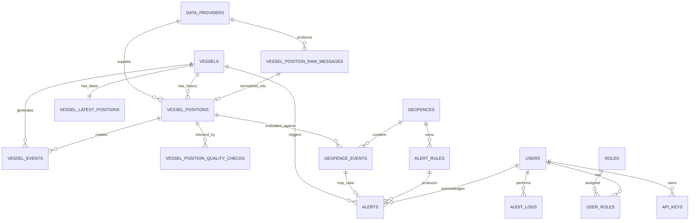
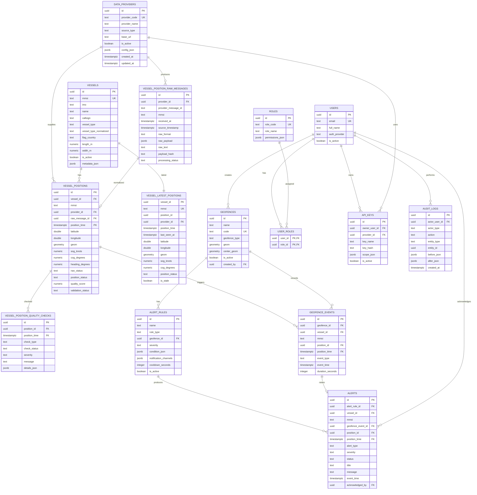

# 05_Database_ERD.md
# Database ERD
# Real Time Vessel Tracking System

**Nama Sistem Contoh:** VesselTrack OS  
**Versi Dokumen:** v1.0  
**Tanggal:** 21 Juni 2026  
**Status:** Draft Awal  
**Diturnunkan dari:** `01_PRD.md`, `02_System_Architecture.md`, `03_Data_Source_Strategy.md`, dan `04_AIS_Data_Model.md`  
**Pendekatan Pengembangan:** AIS API Provider → MVP Tracking → Geofence & Alert → Playback & Analytics → Hardening

---

## 1. Ringkasan Eksekutif

Dokumen ini mendefinisikan **Database Entity Relationship Diagram (ERD)** untuk **Real Time Vessel Tracking System**. ERD ini menjadi fondasi implementasi database untuk modul real-time tracking, historical playback, geofence, alerting, analytics dasar, user management, audit log, dan data source management.

Desain database mengikuti keputusan arsitektur pada dokumen sebelumnya:

1. **PostgreSQL** sebagai relational database utama.
2. **PostGIS** untuk data geospasial seperti posisi kapal, geofence, route, dan viewport map.
3. **TimescaleDB** untuk penyimpanan time-series pada histori posisi kapal.
4. **Redis** untuk cache latest position dan distribusi update real-time.
5. **Object Storage** untuk arsip raw payload berskala besar jika volume data meningkat.

Prinsip utama desain ERD adalah memisahkan **raw message**, **clean vessel position**, **latest position**, **event**, dan **alert** agar sistem tetap rapi, dapat diaudit, dan cepat saat menampilkan peta real-time.

---

## 2. Tujuan Dokumen

Dokumen ini bertujuan untuk:

1. Menyediakan ERD konseptual dan logical schema untuk MVP.
2. Menjelaskan relasi antar tabel utama.
3. Menentukan primary key, foreign key, unique constraint, dan indeks utama.
4. Menjelaskan strategi PostGIS dan TimescaleDB.
5. Menyediakan contoh DDL awal untuk implementasi database.
6. Menjadi acuan untuk dokumen lanjutan:
   - `06_API_Specification.md`
   - `07_Realtime_WebSocket_Spec.md`
   - `08_Geofence_Rule_Spec.md`
   - `09_Alerting_Spec.md`
   - `12_Deployment_Plan.md`
   - `13_Testing_Strategy.md`

---

## 3. Scope Database MVP

### 3.1 Termasuk dalam MVP

Database MVP mencakup tabel untuk:

1. Data provider AIS.
2. Identitas kapal.
3. Raw AIS messages.
4. Historical vessel positions.
5. Latest vessel positions.
6. Position quality checks.
7. Geofence definitions.
8. Geofence events.
9. Operational vessel events.
10. Alerts.
11. Users dan roles.
12. Audit logs.
13. API keys untuk integrasi teknis.

### 3.2 Tidak Termasuk dalam MVP Awal

Fitur berikut disiapkan secara desain, tetapi belum wajib dibangun pada MVP pertama:

1. Full voyage management.
2. Port call management detail.
3. Weather/ocean data integration.
4. Predictive ETA berbasis machine learning.
5. Collision risk advanced engine.
6. Billing atau subscription management.
7. Multi-tenant enterprise isolation penuh.
8. Long-term maritime intelligence warehouse.

---

## 4. Prinsip Desain Database

| Prinsip | Penjelasan |
|---|---|
| Raw and Clean Separation | Data mentah provider disimpan terpisah dari data yang sudah dinormalisasi. |
| Latest and History Separation | Dashboard real-time membaca tabel latest, playback membaca tabel histori. |
| Time-Series Ready | `vessel_positions` dirancang sebagai TimescaleDB hypertable. |
| Geospatial Native | Semua lokasi penting memiliki field `geometry` atau `geography` dengan SRID 4326. |
| Provider-Agnostic | Data provider tidak mengunci model internal ke satu vendor tertentu. |
| Idempotent Ingestion | Constraint mencegah duplikasi event posisi. |
| Audit-Friendly | Raw payload, source metadata, validation status, dan audit log disimpan eksplisit. |
| Performance First | Query map, latest position, geofence, dan history harus memiliki indeks khusus. |
| Extensible | Schema dapat diperluas untuk AIS receiver lokal, GPS tracker, weather, dan analytics. |

---

## 5. Konvensi Penamaan

| Elemen | Konvensi | Contoh |
|---|---|---|
| Tabel | snake_case plural | `vessel_positions` |
| Primary Key | `id UUID` | `id UUID PRIMARY KEY` |
| Foreign Key | `<entity>_id` | `provider_id` |
| Timestamp | timezone-aware | `TIMESTAMPTZ` |
| Geometry | `geom` | `geometry(Point, 4326)` |
| Boolean | prefix `is_` | `is_active` |
| Enum | text + check constraint atau enum type | `status`, `source_type` |
| Created/Updated | standard audit columns | `created_at`, `updated_at` |

---

## 6. High-Level ERD



---

## 7. Modul Database

Database dibagi menjadi beberapa domain logis.

| Domain | Tabel Utama | Fungsi |
|---|---|---|
| Data Source | `data_providers`, `api_keys` | Mengelola sumber data dan akses integrasi. |
| Vessel Registry | `vessels` | Menyimpan identitas kapal. |
| AIS Raw | `vessel_position_raw_messages` | Menyimpan raw provider response atau raw NMEA. |
| AIS Clean | `vessel_positions`, `vessel_latest_positions` | Menyimpan histori dan posisi terakhir kapal. |
| Data Quality | `vessel_position_quality_checks` | Menyimpan hasil validasi dan quality scoring. |
| Geofence | `geofences`, `geofence_events`, `alert_rules` | Area digital dan event masuk/keluar area. |
| Alerting | `alerts` | Notifikasi operasional. |
| User & Access | `users`, `roles`, `user_roles` | Login dan RBAC. |
| Audit | `audit_logs` | Jejak perubahan dan aktivitas user/system. |

---

## 8. Conceptual Entity Description

### 8.1 `data_providers`

Menyimpan metadata sumber data AIS atau GPS.

Contoh provider:

1. AIS API Provider komersial.
2. AIS receiver lokal.
3. GPS/IoT tracker internal.
4. Simulasi data untuk testing.

### 8.2 `vessels`

Menyimpan identitas kapal berdasarkan MMSI/IMO/callsign. MMSI menjadi identifier utama untuk tracking AIS, sedangkan IMO menjadi identifier pendukung untuk kapal yang memilikinya.

### 8.3 `vessel_position_raw_messages`

Menyimpan raw payload dari provider. Ini adalah kotak hitam kapal selam data: tidak dipakai langsung oleh dashboard, tetapi sangat penting untuk debugging, audit, dan reprocessing.

### 8.4 `vessel_positions`

Menyimpan data posisi kapal yang sudah dibersihkan, divalidasi, dan dinormalisasi. Tabel ini adalah time-series utama.

### 8.5 `vessel_latest_positions`

Menyimpan satu baris posisi terakhir per kapal agar dashboard real-time tidak perlu mencari data terbaru dari tabel histori yang besar.

### 8.6 `vessel_position_quality_checks`

Menyimpan hasil validasi seperti koordinat invalid, timestamp stale, speed abnormal, dan jump position.

### 8.7 `geofences`

Menyimpan area geospasial dalam bentuk polygon/multipolygon. Digunakan untuk restricted area, anchorage area, port area, river segment, dan operational zone.

### 8.8 `geofence_events`

Merekam kejadian kapal masuk, keluar, atau berada di dalam geofence.

### 8.9 `alert_rules`

Menyimpan konfigurasi rule untuk menghasilkan alert.

### 8.10 `alerts`

Menyimpan alert aktif, acknowledged, resolved, atau dismissed.

### 8.11 `users`, `roles`, `user_roles`

Menyediakan fondasi RBAC untuk Admin, Operator, Analyst, Viewer, dan External Partner.

### 8.12 `audit_logs`

Merekam tindakan penting seperti membuat geofence, mengubah alert rule, acknowledge alert, atau mengubah konfigurasi data provider.

---

## 9. Logical Table Design

### 9.1 Table: `data_providers`

| Column | Type | Constraint | Description |
|---|---|---|---|
| `id` | UUID | PK | Provider ID. |
| `provider_code` | TEXT | UNIQUE, NOT NULL | Kode singkat provider, contoh `AIS_VENDOR_01`. |
| `provider_name` | TEXT | NOT NULL | Nama provider. |
| `source_type` | TEXT | NOT NULL | `ais_api`, `ais_receiver`, `gps_tracker`, `simulator`. |
| `base_url` | TEXT | NULL | Base URL jika provider API. |
| `coverage_area` | TEXT | NULL | Deskripsi area coverage. |
| `polling_interval_seconds` | INTEGER | NULL | Interval polling default. |
| `latency_target_seconds` | INTEGER | NULL | Target latency operasional. |
| `is_active` | BOOLEAN | DEFAULT TRUE | Status provider. |
| `config_json` | JSONB | NULL | Konfigurasi teknis non-secret. |
| `created_at` | TIMESTAMPTZ | NOT NULL | Waktu dibuat. |
| `updated_at` | TIMESTAMPTZ | NOT NULL | Waktu diubah. |

### 9.2 Table: `vessels`

| Column | Type | Constraint | Description |
|---|---|---|---|
| `id` | UUID | PK | Vessel ID internal. |
| `mmsi` | TEXT | UNIQUE, NOT NULL | Maritime Mobile Service Identity. |
| `imo` | TEXT | NULL | IMO number. |
| `name` | TEXT | NULL | Nama kapal. |
| `callsign` | TEXT | NULL | Callsign kapal. |
| `vessel_type` | TEXT | NULL | Tipe asli dari AIS/provider. |
| `vessel_type_normalized` | TEXT | NULL | Tipe standar internal. |
| `flag_country` | TEXT | NULL | Negara bendera. |
| `length_m` | NUMERIC(8,2) | NULL | Panjang kapal meter. |
| `width_m` | NUMERIC(8,2) | NULL | Lebar kapal meter. |
| `draught_m` | NUMERIC(8,2) | NULL | Draft kapal meter. |
| `gross_tonnage` | NUMERIC(12,2) | NULL | GT jika tersedia. |
| `is_active` | BOOLEAN | DEFAULT TRUE | Apakah kapal aktif dimonitor. |
| `metadata_json` | JSONB | NULL | Metadata tambahan. |
| `created_at` | TIMESTAMPTZ | NOT NULL | Waktu dibuat. |
| `updated_at` | TIMESTAMPTZ | NOT NULL | Waktu diubah. |

### 9.3 Table: `vessel_position_raw_messages`

| Column | Type | Constraint | Description |
|---|---|---|---|
| `id` | UUID | PK | Raw message ID. |
| `provider_id` | UUID | FK → `data_providers.id` | Sumber data. |
| `provider_message_id` | TEXT | NULL | ID message dari provider jika ada. |
| `mmsi` | TEXT | NULL | MMSI hasil ekstraksi awal. |
| `received_at` | TIMESTAMPTZ | NOT NULL | Waktu diterima sistem. |
| `source_timestamp` | TIMESTAMPTZ | NULL | Timestamp dari provider. |
| `raw_format` | TEXT | NOT NULL | `json`, `nmea`, `csv`, `xml`. |
| `raw_payload` | JSONB | NULL | Payload JSON. |
| `raw_text` | TEXT | NULL | Raw NMEA/text. |
| `payload_hash` | TEXT | NOT NULL | Hash untuk dedup raw. |
| `processing_status` | TEXT | NOT NULL | `pending`, `processed`, `failed`, `ignored`. |
| `error_message` | TEXT | NULL | Error saat parsing. |
| `created_at` | TIMESTAMPTZ | NOT NULL | Waktu dibuat. |

### 9.4 Table: `vessel_positions`

Tabel ini direkomendasikan menjadi **TimescaleDB hypertable** berdasarkan `position_time`.

| Column | Type | Constraint | Description |
|---|---|---|---|
| `id` | UUID | PK | Position ID. |
| `vessel_id` | UUID | FK → `vessels.id` | Vessel internal. |
| `mmsi` | TEXT | NOT NULL | MMSI untuk query cepat. |
| `provider_id` | UUID | FK → `data_providers.id` | Sumber data. |
| `raw_message_id` | UUID | FK → `vessel_position_raw_messages.id` | Raw message asal. |
| `position_time` | TIMESTAMPTZ | NOT NULL | Waktu posisi sesuai AIS/provider. |
| `received_at` | TIMESTAMPTZ | NOT NULL | Waktu diterima sistem. |
| `latitude` | DOUBLE PRECISION | NOT NULL | Latitude WGS84. |
| `longitude` | DOUBLE PRECISION | NOT NULL | Longitude WGS84. |
| `geom` | geometry(Point,4326) | NOT NULL | Titik posisi PostGIS. |
| `sog_knots` | NUMERIC(7,2) | NULL | Speed over ground. |
| `cog_degrees` | NUMERIC(6,2) | NULL | Course over ground. |
| `heading_degrees` | NUMERIC(6,2) | NULL | Heading. |
| `rot_degrees_per_minute` | NUMERIC(8,3) | NULL | Rate of turn. |
| `nav_status` | TEXT | NULL | Navigation status asli/normalized. |
| `position_status` | TEXT | NOT NULL | `moving`, `stopped`, `anchored`, `stale`, `unknown`. |
| `latency_seconds` | INTEGER | NULL | Selisih `received_at` dan `position_time`. |
| `quality_score` | NUMERIC(5,2) | NULL | 0-100. |
| `validation_status` | TEXT | NOT NULL | `valid`, `warning`, `invalid`, `suspicious`. |
| `validation_notes` | JSONB | NULL | Catatan validasi. |
| `created_at` | TIMESTAMPTZ | NOT NULL | Waktu insert. |

### 9.5 Table: `vessel_latest_positions`

| Column | Type | Constraint | Description |
|---|---|---|---|
| `vessel_id` | UUID | PK, FK → `vessels.id` | Satu latest row per vessel. |
| `mmsi` | TEXT | UNIQUE, NOT NULL | MMSI. |
| `position_id` | UUID | FK → `vessel_positions.id` | Referensi posisi latest. |
| `provider_id` | UUID | FK → `data_providers.id` | Sumber posisi latest. |
| `position_time` | TIMESTAMPTZ | NOT NULL | Waktu posisi. |
| `last_seen_at` | TIMESTAMPTZ | NOT NULL | Waktu terakhir sistem menerima update. |
| `latitude` | DOUBLE PRECISION | NOT NULL | Latitude. |
| `longitude` | DOUBLE PRECISION | NOT NULL | Longitude. |
| `geom` | geometry(Point,4326) | NOT NULL | Titik latest. |
| `sog_knots` | NUMERIC(7,2) | NULL | SOG. |
| `cog_degrees` | NUMERIC(6,2) | NULL | COG. |
| `heading_degrees` | NUMERIC(6,2) | NULL | Heading. |
| `nav_status` | TEXT | NULL | Status navigasi. |
| `position_status` | TEXT | NOT NULL | Status posisi. |
| `quality_score` | NUMERIC(5,2) | NULL | Quality score latest. |
| `is_stale` | BOOLEAN | DEFAULT FALSE | True jika melewati threshold stale. |
| `updated_at` | TIMESTAMPTZ | NOT NULL | Waktu update latest. |

### 9.6 Table: `vessel_position_quality_checks`

| Column | Type | Constraint | Description |
|---|---|---|---|
| `id` | UUID | PK | Quality check ID. |
| `position_id` | UUID | FK → `vessel_positions.id` | Posisi yang divalidasi. |
| `check_type` | TEXT | NOT NULL | Jenis validasi. |
| `check_status` | TEXT | NOT NULL | `pass`, `warning`, `fail`. |
| `severity` | TEXT | NOT NULL | `low`, `medium`, `high`, `critical`. |
| `message` | TEXT | NULL | Keterangan. |
| `details_json` | JSONB | NULL | Detail teknis. |
| `created_at` | TIMESTAMPTZ | NOT NULL | Waktu dibuat. |

### 9.7 Table: `geofences`

| Column | Type | Constraint | Description |
|---|---|---|---|
| `id` | UUID | PK | Geofence ID. |
| `name` | TEXT | NOT NULL | Nama area. |
| `code` | TEXT | UNIQUE | Kode area, contoh `GF-01`. |
| `geofence_type` | TEXT | NOT NULL | `restricted`, `port`, `anchorage`, `route_corridor`, `custom`. |
| `description` | TEXT | NULL | Deskripsi. |
| `geom` | geometry(MultiPolygon,4326) | NOT NULL | Area geofence. |
| `center_geom` | geometry(Point,4326) | NULL | Titik tengah untuk label peta. |
| `is_active` | BOOLEAN | DEFAULT TRUE | Status aktif. |
| `style_json` | JSONB | NULL | Warna/pola tampilan map. |
| `created_by` | UUID | FK → `users.id` | Pembuat. |
| `created_at` | TIMESTAMPTZ | NOT NULL | Waktu dibuat. |
| `updated_at` | TIMESTAMPTZ | NOT NULL | Waktu diubah. |

### 9.8 Table: `geofence_events`

| Column | Type | Constraint | Description |
|---|---|---|---|
| `id` | UUID | PK | Event geofence ID. |
| `geofence_id` | UUID | FK → `geofences.id` | Area terkait. |
| `vessel_id` | UUID | FK → `vessels.id` | Kapal terkait. |
| `mmsi` | TEXT | NOT NULL | MMSI. |
| `position_id` | UUID | FK → `vessel_positions.id` | Posisi pemicu. |
| `event_type` | TEXT | NOT NULL | `enter`, `exit`, `inside`, `outside`, `dwell`. |
| `event_time` | TIMESTAMPTZ | NOT NULL | Waktu event. |
| `previous_state` | TEXT | NULL | State sebelumnya. |
| `current_state` | TEXT | NULL | State terbaru. |
| `duration_seconds` | INTEGER | NULL | Durasi jika dwell. |
| `created_at` | TIMESTAMPTZ | NOT NULL | Waktu insert. |

### 9.9 Table: `alert_rules`

| Column | Type | Constraint | Description |
|---|---|---|---|
| `id` | UUID | PK | Rule ID. |
| `name` | TEXT | NOT NULL | Nama rule. |
| `rule_type` | TEXT | NOT NULL | `geofence`, `speed`, `ais_silence`, `route_deviation`, `quality`. |
| `geofence_id` | UUID | FK → `geofences.id`, NULL | Geofence jika rule terkait area. |
| `severity` | TEXT | NOT NULL | Default severity alert. |
| `condition_json` | JSONB | NOT NULL | Parameter rule. |
| `notification_channels` | JSONB | NULL | Email/Telegram/WhatsApp/webhook. |
| `cooldown_seconds` | INTEGER | DEFAULT 300 | Anti-spam alert. |
| `is_active` | BOOLEAN | DEFAULT TRUE | Status rule. |
| `created_by` | UUID | FK → `users.id` | Pembuat. |
| `created_at` | TIMESTAMPTZ | NOT NULL | Waktu dibuat. |
| `updated_at` | TIMESTAMPTZ | NOT NULL | Waktu diubah. |

### 9.10 Table: `alerts`

| Column | Type | Constraint | Description |
|---|---|---|---|
| `id` | UUID | PK | Alert ID. |
| `alert_rule_id` | UUID | FK → `alert_rules.id`, NULL | Rule pemicu. |
| `vessel_id` | UUID | FK → `vessels.id`, NULL | Kapal terkait. |
| `mmsi` | TEXT | NULL | MMSI. |
| `geofence_event_id` | UUID | FK → `geofence_events.id`, NULL | Event geofence terkait. |
| `position_id` | UUID | FK → `vessel_positions.id`, NULL | Posisi terkait. |
| `alert_type` | TEXT | NOT NULL | Jenis alert. |
| `severity` | TEXT | NOT NULL | `info`, `warning`, `critical`. |
| `status` | TEXT | NOT NULL | `open`, `acknowledged`, `resolved`, `dismissed`. |
| `title` | TEXT | NOT NULL | Judul alert. |
| `message` | TEXT | NOT NULL | Detail alert. |
| `event_time` | TIMESTAMPTZ | NOT NULL | Waktu kejadian. |
| `acknowledged_by` | UUID | FK → `users.id`, NULL | User ack. |
| `acknowledged_at` | TIMESTAMPTZ | NULL | Waktu ack. |
| `resolved_at` | TIMESTAMPTZ | NULL | Waktu resolved. |
| `metadata_json` | JSONB | NULL | Detail tambahan. |
| `created_at` | TIMESTAMPTZ | NOT NULL | Waktu insert. |

### 9.11 Table: `users`

| Column | Type | Constraint | Description |
|---|---|---|---|
| `id` | UUID | PK | User ID. |
| `email` | TEXT | UNIQUE, NOT NULL | Email login. |
| `full_name` | TEXT | NOT NULL | Nama user. |
| `password_hash` | TEXT | NULL | Password hash jika local auth. |
| `auth_provider` | TEXT | DEFAULT `local` | `local`, `google`, `sso`. |
| `is_active` | BOOLEAN | DEFAULT TRUE | Status user. |
| `last_login_at` | TIMESTAMPTZ | NULL | Login terakhir. |
| `created_at` | TIMESTAMPTZ | NOT NULL | Waktu dibuat. |
| `updated_at` | TIMESTAMPTZ | NOT NULL | Waktu diubah. |

### 9.12 Table: `roles`

| Column | Type | Constraint | Description |
|---|---|---|---|
| `id` | UUID | PK | Role ID. |
| `role_code` | TEXT | UNIQUE, NOT NULL | `admin`, `operator`, `analyst`, `viewer`, `external_partner`. |
| `role_name` | TEXT | NOT NULL | Nama role. |
| `permissions_json` | JSONB | NOT NULL | Daftar permission. |
| `created_at` | TIMESTAMPTZ | NOT NULL | Waktu dibuat. |

### 9.13 Table: `user_roles`

| Column | Type | Constraint | Description |
|---|---|---|---|
| `user_id` | UUID | PK, FK → `users.id` | User. |
| `role_id` | UUID | PK, FK → `roles.id` | Role. |
| `created_at` | TIMESTAMPTZ | NOT NULL | Waktu assignment. |

### 9.14 Table: `api_keys`

| Column | Type | Constraint | Description |
|---|---|---|---|
| `id` | UUID | PK | API Key ID. |
| `owner_user_id` | UUID | FK → `users.id`, NULL | Owner user. |
| `provider_id` | UUID | FK → `data_providers.id`, NULL | Provider terkait jika outbound. |
| `key_name` | TEXT | NOT NULL | Nama key. |
| `key_hash` | TEXT | NOT NULL | Hash API key, bukan secret plain text. |
| `scope_json` | JSONB | NULL | Scope akses. |
| `expires_at` | TIMESTAMPTZ | NULL | Expired. |
| `last_used_at` | TIMESTAMPTZ | NULL | Terakhir dipakai. |
| `is_active` | BOOLEAN | DEFAULT TRUE | Status aktif. |
| `created_at` | TIMESTAMPTZ | NOT NULL | Waktu dibuat. |

### 9.15 Table: `audit_logs`

| Column | Type | Constraint | Description |
|---|---|---|---|
| `id` | UUID | PK | Audit log ID. |
| `actor_user_id` | UUID | FK → `users.id`, NULL | User yang melakukan aksi. |
| `actor_type` | TEXT | NOT NULL | `user`, `system`, `api_key`, `job`. |
| `action` | TEXT | NOT NULL | Jenis aksi. |
| `entity_type` | TEXT | NOT NULL | Tipe entity. |
| `entity_id` | UUID | NULL | ID entity. |
| `before_json` | JSONB | NULL | Nilai sebelum. |
| `after_json` | JSONB | NULL | Nilai sesudah. |
| `ip_address` | INET | NULL | IP user/API. |
| `user_agent` | TEXT | NULL | User agent. |
| `created_at` | TIMESTAMPTZ | NOT NULL | Waktu aksi. |

---

## 10. Relationship Detail

### 10.1 Provider ke Raw Message

```text
Data provider menghasilkan banyak raw messages.
1 data_providers → many vessel_position_raw_messages
```

Setiap raw message wajib memiliki `provider_id` agar sistem mengetahui asal data, latency, SLA, dan lisensi.

### 10.2 Raw Message ke Clean Position

```text
1 raw message → 0 atau 1 clean position
```

Raw message bisa gagal diproses, duplikat, atau invalid. Karena itu relasi ke `vessel_positions` bersifat opsional dari sisi raw.

### 10.3 Vessel ke Positions

```text
1 vessel → many vessel_positions
```

Histori posisi adalah event stream. Satu kapal dapat memiliki jutaan baris posisi dalam jangka panjang.

### 10.4 Vessel ke Latest Position

```text
1 vessel → 0 atau 1 vessel_latest_positions
```

Kapal yang belum memiliki posisi valid tidak memiliki latest position.

### 10.5 Position ke Geofence Event

```text
1 vessel_position → 0 atau many geofence_events
```

Satu posisi dapat memicu beberapa geofence event jika berada di beberapa polygon yang overlap.

### 10.6 Geofence Event ke Alert

```text
1 geofence_event → 0 atau 1 alert
```

Tidak semua geofence event menjadi alert. Contoh `inside` periodik bisa hanya menjadi event tanpa alert jika tidak memenuhi rule.

### 10.7 Alert Rule ke Alert

```text
1 alert_rule → many alerts
```

Rule dapat menghasilkan banyak alert sepanjang waktu. Cooldown diperlukan agar alert tidak meledak seperti kembang api di dashboard operator.

---

## 11. Cardinality Matrix

| Parent | Child | Cardinality | Catatan |
|---|---|---|---|
| `data_providers` | `vessel_position_raw_messages` | 1:N | Raw data berasal dari provider. |
| `data_providers` | `vessel_positions` | 1:N | Clean data tetap menyimpan provider. |
| `vessels` | `vessel_positions` | 1:N | Histori posisi kapal. |
| `vessels` | `vessel_latest_positions` | 1:0..1 | Latest position per kapal. |
| `vessel_positions` | `vessel_position_quality_checks` | 1:N | Banyak check per posisi. |
| `geofences` | `geofence_events` | 1:N | Event per area. |
| `geofences` | `alert_rules` | 1:N | Rule per area. |
| `alert_rules` | `alerts` | 1:N | Rule menghasilkan alert. |
| `users` | `alerts` | 1:N | User acknowledge alert. |
| `users` | `audit_logs` | 1:N | User activity. |
| `users` | `roles` | N:M | Melalui `user_roles`. |

---

## 12. Physical Database Design

### 12.1 Required Extensions

```sql
CREATE EXTENSION IF NOT EXISTS "uuid-ossp";
CREATE EXTENSION IF NOT EXISTS postgis;
CREATE EXTENSION IF NOT EXISTS timescaledb;
CREATE EXTENSION IF NOT EXISTS pgcrypto;
```

### 12.2 Schema Layout

Untuk MVP, semua tabel dapat berada pada schema `public`. Untuk production, disarankan membagi schema:

| Schema | Isi |
|---|---|
| `core` | Vessel, provider, user, role. |
| `ais` | Raw message, positions, latest position, quality checks. |
| `geo` | Geofences dan geofence events. |
| `ops` | Alerts, alert rules, audit logs. |

MVP dapat memakai `public` agar sederhana, lalu dimigrasikan saat sistem mulai besar.

---

## 13. Core DDL MVP

> Catatan: DDL berikut adalah baseline awal. Implementasi final dapat disesuaikan oleh backend framework migration tool seperti Prisma, TypeORM, Alembic, atau Flyway.

```sql
CREATE EXTENSION IF NOT EXISTS "uuid-ossp";
CREATE EXTENSION IF NOT EXISTS postgis;
CREATE EXTENSION IF NOT EXISTS timescaledb;
CREATE EXTENSION IF NOT EXISTS pgcrypto;
```

### 13.1 `data_providers`

```sql
CREATE TABLE data_providers (
    id UUID PRIMARY KEY DEFAULT gen_random_uuid(),
    provider_code TEXT NOT NULL UNIQUE,
    provider_name TEXT NOT NULL,
    source_type TEXT NOT NULL CHECK (source_type IN ('ais_api', 'ais_receiver', 'gps_tracker', 'simulator')),
    base_url TEXT,
    coverage_area TEXT,
    polling_interval_seconds INTEGER,
    latency_target_seconds INTEGER,
    is_active BOOLEAN NOT NULL DEFAULT TRUE,
    config_json JSONB,
    created_at TIMESTAMPTZ NOT NULL DEFAULT now(),
    updated_at TIMESTAMPTZ NOT NULL DEFAULT now()
);
```

### 13.2 `users`, `roles`, `user_roles`

```sql
CREATE TABLE users (
    id UUID PRIMARY KEY DEFAULT gen_random_uuid(),
    email TEXT NOT NULL UNIQUE,
    full_name TEXT NOT NULL,
    password_hash TEXT,
    auth_provider TEXT NOT NULL DEFAULT 'local',
    is_active BOOLEAN NOT NULL DEFAULT TRUE,
    last_login_at TIMESTAMPTZ,
    created_at TIMESTAMPTZ NOT NULL DEFAULT now(),
    updated_at TIMESTAMPTZ NOT NULL DEFAULT now()
);

CREATE TABLE roles (
    id UUID PRIMARY KEY DEFAULT gen_random_uuid(),
    role_code TEXT NOT NULL UNIQUE,
    role_name TEXT NOT NULL,
    permissions_json JSONB NOT NULL DEFAULT '{}'::jsonb,
    created_at TIMESTAMPTZ NOT NULL DEFAULT now()
);

CREATE TABLE user_roles (
    user_id UUID NOT NULL REFERENCES users(id) ON DELETE CASCADE,
    role_id UUID NOT NULL REFERENCES roles(id) ON DELETE CASCADE,
    created_at TIMESTAMPTZ NOT NULL DEFAULT now(),
    PRIMARY KEY (user_id, role_id)
);
```

### 13.3 `vessels`

```sql
CREATE TABLE vessels (
    id UUID PRIMARY KEY DEFAULT gen_random_uuid(),
    mmsi TEXT NOT NULL UNIQUE,
    imo TEXT,
    name TEXT,
    callsign TEXT,
    vessel_type TEXT,
    vessel_type_normalized TEXT,
    flag_country TEXT,
    length_m NUMERIC(8,2),
    width_m NUMERIC(8,2),
    draught_m NUMERIC(8,2),
    gross_tonnage NUMERIC(12,2),
    is_active BOOLEAN NOT NULL DEFAULT TRUE,
    metadata_json JSONB,
    created_at TIMESTAMPTZ NOT NULL DEFAULT now(),
    updated_at TIMESTAMPTZ NOT NULL DEFAULT now()
);

CREATE INDEX idx_vessels_name ON vessels (name);
CREATE INDEX idx_vessels_imo ON vessels (imo);
CREATE INDEX idx_vessels_type ON vessels (vessel_type_normalized);
```

### 13.4 `vessel_position_raw_messages`

```sql
CREATE TABLE vessel_position_raw_messages (
    id UUID PRIMARY KEY DEFAULT gen_random_uuid(),
    provider_id UUID NOT NULL REFERENCES data_providers(id),
    provider_message_id TEXT,
    mmsi TEXT,
    received_at TIMESTAMPTZ NOT NULL DEFAULT now(),
    source_timestamp TIMESTAMPTZ,
    raw_format TEXT NOT NULL CHECK (raw_format IN ('json', 'nmea', 'csv', 'xml')),
    raw_payload JSONB,
    raw_text TEXT,
    payload_hash TEXT NOT NULL,
    processing_status TEXT NOT NULL DEFAULT 'pending' CHECK (processing_status IN ('pending', 'processed', 'failed', 'ignored')),
    error_message TEXT,
    created_at TIMESTAMPTZ NOT NULL DEFAULT now(),
    UNIQUE (provider_id, payload_hash)
);

CREATE INDEX idx_raw_messages_provider_received ON vessel_position_raw_messages (provider_id, received_at DESC);
CREATE INDEX idx_raw_messages_mmsi_received ON vessel_position_raw_messages (mmsi, received_at DESC);
CREATE INDEX idx_raw_messages_status ON vessel_position_raw_messages (processing_status);
```

### 13.5 `vessel_positions`

```sql
CREATE TABLE vessel_positions (
    id UUID DEFAULT gen_random_uuid(),
    vessel_id UUID NOT NULL REFERENCES vessels(id),
    mmsi TEXT NOT NULL,
    provider_id UUID NOT NULL REFERENCES data_providers(id),
    raw_message_id UUID REFERENCES vessel_position_raw_messages(id),
    position_time TIMESTAMPTZ NOT NULL,
    received_at TIMESTAMPTZ NOT NULL DEFAULT now(),
    latitude DOUBLE PRECISION NOT NULL CHECK (latitude BETWEEN -90 AND 90),
    longitude DOUBLE PRECISION NOT NULL CHECK (longitude BETWEEN -180 AND 180),
    geom geometry(Point, 4326) NOT NULL,
    sog_knots NUMERIC(7,2),
    cog_degrees NUMERIC(6,2),
    heading_degrees NUMERIC(6,2),
    rot_degrees_per_minute NUMERIC(8,3),
    nav_status TEXT,
    position_status TEXT NOT NULL DEFAULT 'unknown',
    latency_seconds INTEGER,
    quality_score NUMERIC(5,2),
    validation_status TEXT NOT NULL DEFAULT 'valid' CHECK (validation_status IN ('valid', 'warning', 'invalid', 'suspicious')),
    validation_notes JSONB,
    created_at TIMESTAMPTZ NOT NULL DEFAULT now(),
    PRIMARY KEY (id, position_time)
);

SELECT create_hypertable('vessel_positions', 'position_time', if_not_exists => TRUE);

CREATE INDEX idx_vessel_positions_mmsi_time ON vessel_positions (mmsi, position_time DESC);
CREATE INDEX idx_vessel_positions_vessel_time ON vessel_positions (vessel_id, position_time DESC);
CREATE INDEX idx_vessel_positions_time ON vessel_positions (position_time DESC);
CREATE INDEX idx_vessel_positions_geom ON vessel_positions USING GIST (geom);
CREATE INDEX idx_vessel_positions_provider_time ON vessel_positions (provider_id, position_time DESC);
CREATE INDEX idx_vessel_positions_validation ON vessel_positions (validation_status);

CREATE UNIQUE INDEX uq_vessel_positions_dedup
    ON vessel_positions (mmsi, position_time, latitude, longitude, provider_id);
```

### 13.6 `vessel_latest_positions`

```sql
CREATE TABLE vessel_latest_positions (
    vessel_id UUID PRIMARY KEY REFERENCES vessels(id) ON DELETE CASCADE,
    mmsi TEXT NOT NULL UNIQUE,
    position_id UUID,
    provider_id UUID NOT NULL REFERENCES data_providers(id),
    position_time TIMESTAMPTZ NOT NULL,
    last_seen_at TIMESTAMPTZ NOT NULL,
    latitude DOUBLE PRECISION NOT NULL CHECK (latitude BETWEEN -90 AND 90),
    longitude DOUBLE PRECISION NOT NULL CHECK (longitude BETWEEN -180 AND 180),
    geom geometry(Point, 4326) NOT NULL,
    sog_knots NUMERIC(7,2),
    cog_degrees NUMERIC(6,2),
    heading_degrees NUMERIC(6,2),
    nav_status TEXT,
    position_status TEXT NOT NULL DEFAULT 'unknown',
    quality_score NUMERIC(5,2),
    is_stale BOOLEAN NOT NULL DEFAULT FALSE,
    updated_at TIMESTAMPTZ NOT NULL DEFAULT now()
);

CREATE INDEX idx_latest_positions_geom ON vessel_latest_positions USING GIST (geom);
CREATE INDEX idx_latest_positions_status ON vessel_latest_positions (position_status);
CREATE INDEX idx_latest_positions_stale ON vessel_latest_positions (is_stale);
CREATE INDEX idx_latest_positions_last_seen ON vessel_latest_positions (last_seen_at DESC);
```

### 13.7 `vessel_position_quality_checks`

```sql
CREATE TABLE vessel_position_quality_checks (
    id UUID PRIMARY KEY DEFAULT gen_random_uuid(),
    position_id UUID NOT NULL,
    position_time TIMESTAMPTZ NOT NULL,
    check_type TEXT NOT NULL,
    check_status TEXT NOT NULL CHECK (check_status IN ('pass', 'warning', 'fail')),
    severity TEXT NOT NULL CHECK (severity IN ('low', 'medium', 'high', 'critical')),
    message TEXT,
    details_json JSONB,
    created_at TIMESTAMPTZ NOT NULL DEFAULT now(),
    FOREIGN KEY (position_id, position_time) REFERENCES vessel_positions(id, position_time) ON DELETE CASCADE
);

CREATE INDEX idx_quality_position ON vessel_position_quality_checks (position_id, position_time);
CREATE INDEX idx_quality_type_status ON vessel_position_quality_checks (check_type, check_status);
```

### 13.8 `geofences`

```sql
CREATE TABLE geofences (
    id UUID PRIMARY KEY DEFAULT gen_random_uuid(),
    name TEXT NOT NULL,
    code TEXT UNIQUE,
    geofence_type TEXT NOT NULL CHECK (geofence_type IN ('restricted', 'port', 'anchorage', 'route_corridor', 'custom')),
    description TEXT,
    geom geometry(MultiPolygon, 4326) NOT NULL,
    center_geom geometry(Point, 4326),
    is_active BOOLEAN NOT NULL DEFAULT TRUE,
    style_json JSONB,
    created_by UUID REFERENCES users(id),
    created_at TIMESTAMPTZ NOT NULL DEFAULT now(),
    updated_at TIMESTAMPTZ NOT NULL DEFAULT now()
);

CREATE INDEX idx_geofences_geom ON geofences USING GIST (geom);
CREATE INDEX idx_geofences_active ON geofences (is_active);
CREATE INDEX idx_geofences_type ON geofences (geofence_type);
```

### 13.9 `geofence_events`

```sql
CREATE TABLE geofence_events (
    id UUID PRIMARY KEY DEFAULT gen_random_uuid(),
    geofence_id UUID NOT NULL REFERENCES geofences(id),
    vessel_id UUID NOT NULL REFERENCES vessels(id),
    mmsi TEXT NOT NULL,
    position_id UUID NOT NULL,
    position_time TIMESTAMPTZ NOT NULL,
    event_type TEXT NOT NULL CHECK (event_type IN ('enter', 'exit', 'inside', 'outside', 'dwell')),
    event_time TIMESTAMPTZ NOT NULL,
    previous_state TEXT,
    current_state TEXT,
    duration_seconds INTEGER,
    created_at TIMESTAMPTZ NOT NULL DEFAULT now(),
    FOREIGN KEY (position_id, position_time) REFERENCES vessel_positions(id, position_time)
);

CREATE INDEX idx_geofence_events_geofence_time ON geofence_events (geofence_id, event_time DESC);
CREATE INDEX idx_geofence_events_mmsi_time ON geofence_events (mmsi, event_time DESC);
CREATE INDEX idx_geofence_events_type ON geofence_events (event_type);
```

### 13.10 `alert_rules`

```sql
CREATE TABLE alert_rules (
    id UUID PRIMARY KEY DEFAULT gen_random_uuid(),
    name TEXT NOT NULL,
    rule_type TEXT NOT NULL CHECK (rule_type IN ('geofence', 'speed', 'ais_silence', 'route_deviation', 'quality')),
    geofence_id UUID REFERENCES geofences(id),
    severity TEXT NOT NULL CHECK (severity IN ('info', 'warning', 'critical')),
    condition_json JSONB NOT NULL,
    notification_channels JSONB,
    cooldown_seconds INTEGER NOT NULL DEFAULT 300,
    is_active BOOLEAN NOT NULL DEFAULT TRUE,
    created_by UUID REFERENCES users(id),
    created_at TIMESTAMPTZ NOT NULL DEFAULT now(),
    updated_at TIMESTAMPTZ NOT NULL DEFAULT now()
);

CREATE INDEX idx_alert_rules_type_active ON alert_rules (rule_type, is_active);
CREATE INDEX idx_alert_rules_geofence ON alert_rules (geofence_id);
```

### 13.11 `alerts`

```sql
CREATE TABLE alerts (
    id UUID PRIMARY KEY DEFAULT gen_random_uuid(),
    alert_rule_id UUID REFERENCES alert_rules(id),
    vessel_id UUID REFERENCES vessels(id),
    mmsi TEXT,
    geofence_event_id UUID REFERENCES geofence_events(id),
    position_id UUID,
    position_time TIMESTAMPTZ,
    alert_type TEXT NOT NULL,
    severity TEXT NOT NULL CHECK (severity IN ('info', 'warning', 'critical')),
    status TEXT NOT NULL DEFAULT 'open' CHECK (status IN ('open', 'acknowledged', 'resolved', 'dismissed')),
    title TEXT NOT NULL,
    message TEXT NOT NULL,
    event_time TIMESTAMPTZ NOT NULL,
    acknowledged_by UUID REFERENCES users(id),
    acknowledged_at TIMESTAMPTZ,
    resolved_at TIMESTAMPTZ,
    metadata_json JSONB,
    created_at TIMESTAMPTZ NOT NULL DEFAULT now(),
    FOREIGN KEY (position_id, position_time) REFERENCES vessel_positions(id, position_time)
);

CREATE INDEX idx_alerts_status_severity ON alerts (status, severity);
CREATE INDEX idx_alerts_event_time ON alerts (event_time DESC);
CREATE INDEX idx_alerts_mmsi_time ON alerts (mmsi, event_time DESC);
CREATE INDEX idx_alerts_rule_time ON alerts (alert_rule_id, event_time DESC);
```

### 13.12 `api_keys`

```sql
CREATE TABLE api_keys (
    id UUID PRIMARY KEY DEFAULT gen_random_uuid(),
    owner_user_id UUID REFERENCES users(id),
    provider_id UUID REFERENCES data_providers(id),
    key_name TEXT NOT NULL,
    key_hash TEXT NOT NULL,
    scope_json JSONB,
    expires_at TIMESTAMPTZ,
    last_used_at TIMESTAMPTZ,
    is_active BOOLEAN NOT NULL DEFAULT TRUE,
    created_at TIMESTAMPTZ NOT NULL DEFAULT now()
);

CREATE INDEX idx_api_keys_owner ON api_keys (owner_user_id);
CREATE INDEX idx_api_keys_provider ON api_keys (provider_id);
CREATE INDEX idx_api_keys_active ON api_keys (is_active);
```

### 13.13 `audit_logs`

```sql
CREATE TABLE audit_logs (
    id UUID PRIMARY KEY DEFAULT gen_random_uuid(),
    actor_user_id UUID REFERENCES users(id),
    actor_type TEXT NOT NULL CHECK (actor_type IN ('user', 'system', 'api_key', 'job')),
    action TEXT NOT NULL,
    entity_type TEXT NOT NULL,
    entity_id UUID,
    before_json JSONB,
    after_json JSONB,
    ip_address INET,
    user_agent TEXT,
    created_at TIMESTAMPTZ NOT NULL DEFAULT now()
);

CREATE INDEX idx_audit_logs_actor_time ON audit_logs (actor_user_id, created_at DESC);
CREATE INDEX idx_audit_logs_entity ON audit_logs (entity_type, entity_id);
CREATE INDEX idx_audit_logs_action_time ON audit_logs (action, created_at DESC);
```

---

## 14. PostGIS Design

### 14.1 Coordinate Reference System

Semua data lokasi menggunakan:

```text
SRID: 4326
Coordinate System: WGS84
```

Field geospasial utama:

| Table | Column | Type | Usage |
|---|---|---|---|
| `vessel_positions` | `geom` | `geometry(Point,4326)` | Histori posisi. |
| `vessel_latest_positions` | `geom` | `geometry(Point,4326)` | Query viewport map. |
| `geofences` | `geom` | `geometry(MultiPolygon,4326)` | Area geofence. |
| `geofences` | `center_geom` | `geometry(Point,4326)` | Label dan zoom map. |

### 14.2 Query Kapal dalam Viewport

```sql
SELECT
    vlp.mmsi,
    v.name,
    vlp.latitude,
    vlp.longitude,
    vlp.sog_knots,
    vlp.cog_degrees,
    vlp.position_status,
    vlp.last_seen_at
FROM vessel_latest_positions vlp
JOIN vessels v ON v.id = vlp.vessel_id
WHERE ST_Intersects(
    vlp.geom,
    ST_MakeEnvelope(:min_lon, :min_lat, :max_lon, :max_lat, 4326)
)
AND vlp.is_stale = FALSE;
```

### 14.3 Query Kapal di Dalam Geofence

```sql
SELECT
    vlp.mmsi,
    v.name,
    g.name AS geofence_name
FROM vessel_latest_positions vlp
JOIN vessels v ON v.id = vlp.vessel_id
JOIN geofences g ON ST_Contains(g.geom, vlp.geom)
WHERE g.id = :geofence_id
AND g.is_active = TRUE;
```

### 14.4 Query Jarak Kapal ke Titik

Untuk query jarak yang lebih akurat, cast ke `geography`.

```sql
SELECT
    vlp.mmsi,
    v.name,
    ST_Distance(
        vlp.geom::geography,
        ST_SetSRID(ST_MakePoint(:lon, :lat), 4326)::geography
    ) AS distance_meters
FROM vessel_latest_positions vlp
JOIN vessels v ON v.id = vlp.vessel_id
ORDER BY distance_meters ASC
LIMIT 20;
```

---

## 15. TimescaleDB Design

### 15.1 Hypertable

Tabel `vessel_positions` menjadi hypertable berdasarkan `position_time`.

```sql
SELECT create_hypertable('vessel_positions', 'position_time', if_not_exists => TRUE);
```

### 15.2 Chunk Interval

Rekomendasi awal:

| Volume Data | Chunk Interval |
|---|---|
| Rendah | 7 hari |
| Menengah | 1 hari |
| Tinggi | 6-12 jam |

Untuk MVP dengan area terbatas, mulai dari **7 hari** lalu evaluasi.

```sql
SELECT set_chunk_time_interval('vessel_positions', INTERVAL '7 days');
```

### 15.3 Compression Policy

Setelah data lebih tua dari 30 hari, kompresi dapat diaktifkan.

```sql
ALTER TABLE vessel_positions SET (
    timescaledb.compress,
    timescaledb.compress_segmentby = 'mmsi',
    timescaledb.compress_orderby = 'position_time DESC'
);

SELECT add_compression_policy('vessel_positions', INTERVAL '30 days');
```

### 15.4 Retention Policy

Retention tergantung kebutuhan bisnis.

| Data | MVP Retention | Production Retention |
|---|---:|---:|
| Raw message | 30-90 hari | 6-12 bulan atau archive object storage |
| Clean position | 6-12 bulan | 1-5 tahun |
| Latest position | Selalu current | Selalu current |
| Geofence events | 6-12 bulan | 1-5 tahun |
| Alerts | 6-12 bulan | 1-5 tahun |
| Audit logs | 1 tahun | 3-7 tahun |

---

## 16. Latest Position Upsert Pattern

Setelah posisi valid masuk ke `vessel_positions`, sistem harus melakukan upsert ke `vessel_latest_positions` hanya jika data baru lebih mutakhir.

```sql
INSERT INTO vessel_latest_positions (
    vessel_id,
    mmsi,
    position_id,
    provider_id,
    position_time,
    last_seen_at,
    latitude,
    longitude,
    geom,
    sog_knots,
    cog_degrees,
    heading_degrees,
    nav_status,
    position_status,
    quality_score,
    is_stale,
    updated_at
)
VALUES (
    :vessel_id,
    :mmsi,
    :position_id,
    :provider_id,
    :position_time,
    :received_at,
    :latitude,
    :longitude,
    ST_SetSRID(ST_MakePoint(:longitude, :latitude), 4326),
    :sog_knots,
    :cog_degrees,
    :heading_degrees,
    :nav_status,
    :position_status,
    :quality_score,
    FALSE,
    now()
)
ON CONFLICT (vessel_id)
DO UPDATE SET
    position_id = EXCLUDED.position_id,
    provider_id = EXCLUDED.provider_id,
    position_time = EXCLUDED.position_time,
    last_seen_at = EXCLUDED.last_seen_at,
    latitude = EXCLUDED.latitude,
    longitude = EXCLUDED.longitude,
    geom = EXCLUDED.geom,
    sog_knots = EXCLUDED.sog_knots,
    cog_degrees = EXCLUDED.cog_degrees,
    heading_degrees = EXCLUDED.heading_degrees,
    nav_status = EXCLUDED.nav_status,
    position_status = EXCLUDED.position_status,
    quality_score = EXCLUDED.quality_score,
    is_stale = FALSE,
    updated_at = now()
WHERE vessel_latest_positions.position_time <= EXCLUDED.position_time;
```

---

## 17. Indexing Strategy

### 17.1 Map Dashboard

| Query | Index |
|---|---|
| Latest vessel by viewport | `GIST(vessel_latest_positions.geom)` |
| Filter status | `vessel_latest_positions(position_status)` |
| Exclude stale vessels | `vessel_latest_positions(is_stale)` |
| Sort by last update | `vessel_latest_positions(last_seen_at DESC)` |

### 17.2 Track History

| Query | Index |
|---|---|
| History per MMSI | `vessel_positions(mmsi, position_time DESC)` |
| History per vessel ID | `vessel_positions(vessel_id, position_time DESC)` |
| Time range query | `vessel_positions(position_time DESC)` |

### 17.3 Geofence

| Query | Index |
|---|---|
| Point-in-polygon | `GIST(geofences.geom)` |
| Active geofences only | `geofences(is_active)` |
| Events per geofence | `geofence_events(geofence_id, event_time DESC)` |

### 17.4 Alerting

| Query | Index |
|---|---|
| Open critical alerts | `alerts(status, severity)` |
| Recent alerts | `alerts(event_time DESC)` |
| Alerts per vessel | `alerts(mmsi, event_time DESC)` |

---

## 18. Data Integrity Rules

### 18.1 MMSI

MMSI disimpan sebagai `TEXT`, bukan integer, agar tidak kehilangan leading zero jika ada data khusus dari provider.

Rule:

1. Wajib ada untuk position yang valid.
2. Direkomendasikan 9 digit untuk data AIS normal.
3. Nilai kosong atau format aneh masuk raw, tetapi clean position harus ditandai invalid/suspicious.

### 18.2 Latitude dan Longitude

Rule:

```text
latitude: -90 sampai 90
longitude: -180 sampai 180
```

Jika koordinat berada di luar range, raw tetap disimpan, tetapi clean position tidak digunakan untuk latest map.

### 18.3 Timestamp

Rule:

1. `position_time` tidak boleh null.
2. `position_time` tidak boleh terlalu jauh di masa depan.
3. Jika `position_time` terlalu lama, posisi ditandai `stale`.
4. `received_at` wajib diisi oleh sistem.

### 18.4 Deduplication

Raw payload:

```text
UNIQUE(provider_id, payload_hash)
```

Clean position:

```text
UNIQUE(mmsi, position_time, latitude, longitude, provider_id)
```

### 18.5 Referential Integrity

1. `vessel_positions.vessel_id` wajib valid.
2. `vessel_latest_positions.vessel_id` cascade delete jika vessel dihapus, tetapi production sebaiknya soft delete vessel.
3. Alert dan event sebaiknya tidak cascade delete untuk menjaga audit trail.

---

## 19. Database Views

### 19.1 View: `vw_active_vessels_map`

View untuk mempercepat konsumsi dashboard.

```sql
CREATE OR REPLACE VIEW vw_active_vessels_map AS
SELECT
    v.id AS vessel_id,
    v.mmsi,
    v.name,
    v.vessel_type_normalized,
    v.flag_country,
    vlp.position_time,
    vlp.last_seen_at,
    vlp.latitude,
    vlp.longitude,
    vlp.geom,
    vlp.sog_knots,
    vlp.cog_degrees,
    vlp.heading_degrees,
    vlp.nav_status,
    vlp.position_status,
    vlp.quality_score,
    vlp.is_stale
FROM vessels v
JOIN vessel_latest_positions vlp ON vlp.vessel_id = v.id
WHERE v.is_active = TRUE;
```

### 19.2 View: `vw_open_alerts`

```sql
CREATE OR REPLACE VIEW vw_open_alerts AS
SELECT
    a.id,
    a.alert_type,
    a.severity,
    a.status,
    a.title,
    a.message,
    a.event_time,
    a.mmsi,
    v.name AS vessel_name,
    g.name AS geofence_name
FROM alerts a
LEFT JOIN vessels v ON v.id = a.vessel_id
LEFT JOIN geofence_events ge ON ge.id = a.geofence_event_id
LEFT JOIN geofences g ON g.id = ge.geofence_id
WHERE a.status IN ('open', 'acknowledged');
```

---

## 20. Seed Data Awal

### 20.1 Roles

```sql
INSERT INTO roles (role_code, role_name, permissions_json) VALUES
('admin', 'Administrator', '{"all": true}'::jsonb),
('operator', 'Operator', '{"map:view": true, "alerts:ack": true, "geofence:view": true}'::jsonb),
('analyst', 'Analyst', '{"map:view": true, "history:view": true, "analytics:view": true}'::jsonb),
('viewer', 'Viewer', '{"map:view": true}'::jsonb),
('external_partner', 'External Partner', '{"map:view_limited": true}'::jsonb);
```

### 20.2 Data Provider Simulator

```sql
INSERT INTO data_providers (
    provider_code,
    provider_name,
    source_type,
    polling_interval_seconds,
    latency_target_seconds,
    is_active
) VALUES (
    'SIM_AIS_01',
    'AIS Simulator Provider',
    'simulator',
    10,
    30,
    TRUE
);
```

---

## 21. Migration Strategy

### 21.1 Tooling Options

| Backend | Recommended Migration Tool |
|---|---|
| FastAPI / Python | Alembic |
| NestJS / TypeScript | TypeORM Migration / Prisma Migrate |
| Java / Spring | Flyway / Liquibase |

### 21.2 Migration Order

Urutan migration awal:

1. Enable extensions.
2. Create identity/access tables.
3. Create data provider tables.
4. Create vessel registry.
5. Create raw message table.
6. Create vessel positions hypertable.
7. Create latest position table.
8. Create quality check table.
9. Create geofence table.
10. Create geofence event table.
11. Create alert rule table.
12. Create alerts table.
13. Create API keys and audit logs.
14. Create indexes and views.
15. Insert seed roles and simulator provider.

---

## 22. Performance Considerations

### 22.1 Dashboard Map

Dashboard real-time harus membaca `vessel_latest_positions`, bukan `vessel_positions`.

Target MVP:

| Metric | Target |
|---|---:|
| Query viewport latest vessels | < 500 ms |
| Latest position update | < 1 detik setelah clean position masuk |
| Alert list query | < 300 ms |
| Track history 24 jam per kapal | < 2 detik |

### 22.2 Avoid Query Anti-Pattern

Hindari query seperti ini untuk dashboard:

```sql
SELECT DISTINCT ON (mmsi) *
FROM vessel_positions
ORDER BY mmsi, position_time DESC;
```

Query ini akan makin berat saat histori membesar. Gunakan `vessel_latest_positions`.

### 22.3 Map Clustering

Jika jumlah kapal dalam viewport besar, backend API dapat melakukan:

1. Bounding box filtering.
2. Limit by zoom level.
3. Server-side clustering.
4. Tile-based response.

---

## 23. Security Considerations

### 23.1 Secret Handling

Jangan menyimpan provider API key secara plain text di `data_providers.config_json`. Gunakan secret manager atau encrypted storage.

### 23.2 API Key

`api_keys.key_hash` hanya menyimpan hash, bukan nilai asli API key.

### 23.3 Audit Log

Audit log wajib untuk aksi:

1. Login/logout penting.
2. Create/update/delete geofence.
3. Create/update/delete alert rule.
4. Acknowledge/resolve alert.
5. Update data provider.
6. Export data.
7. User/role changes.

### 23.4 Row-Level Security Future

Untuk multi-tenant atau external partner, dapat ditambahkan:

1. `tenant_id` pada tabel utama.
2. PostgreSQL Row Level Security.
3. Area-based access control.
4. Vessel group access.

---

## 24. Future Extension Tables

Tabel berikut disiapkan untuk fase lanjutan.

### 24.1 `routes`

Untuk planned route atau route corridor.

```text
routes
- id
- name
- description
- geom LineString/MultiLineString
- created_at
```

### 24.2 `voyages`

Untuk pelayaran dari origin ke destination.

```text
voyages
- id
- vessel_id
- origin_port
- destination_port
- eta
- etd
- status
```

### 24.3 `ports`

Untuk master pelabuhan.

```text
ports
- id
- port_code
- name
- country
- geom
- boundary_geom
```

### 24.4 `weather_observations`

Untuk integrasi cuaca/arus/gelombang.

```text
weather_observations
- id
- observation_time
- geom
- wind_speed
- wave_height
- current_speed
- provider_id
```

### 24.5 `vessel_groups`

Untuk mengelompokkan kapal internal, fleet, atau partner.

```text
vessel_groups
- id
- name
- description

vessel_group_members
- vessel_group_id
- vessel_id
```

---

## 25. Example Query Patterns

### 25.1 Search Vessel

```sql
SELECT id, mmsi, imo, name, callsign, vessel_type_normalized
FROM vessels
WHERE
    mmsi ILIKE :keyword
    OR imo ILIKE :keyword
    OR name ILIKE '%' || :keyword || '%'
    OR callsign ILIKE :keyword
ORDER BY name ASC
LIMIT 20;
```

### 25.2 Track History per Vessel

```sql
SELECT
    position_time,
    latitude,
    longitude,
    sog_knots,
    cog_degrees,
    heading_degrees,
    nav_status,
    quality_score
FROM vessel_positions
WHERE mmsi = :mmsi
AND position_time BETWEEN :start_time AND :end_time
AND validation_status IN ('valid', 'warning')
ORDER BY position_time ASC;
```

### 25.3 Recent Critical Alerts

```sql
SELECT *
FROM alerts
WHERE status = 'open'
AND severity = 'critical'
ORDER BY event_time DESC
LIMIT 50;
```

### 25.4 Vessel Count by Status

```sql
SELECT position_status, COUNT(*)
FROM vessel_latest_positions
GROUP BY position_status
ORDER BY COUNT(*) DESC;
```

### 25.5 Vessel Density by Area

MVP sederhana dapat memakai geofence aggregation.

```sql
SELECT
    g.id,
    g.name,
    COUNT(vlp.vessel_id) AS vessel_count
FROM geofences g
LEFT JOIN vessel_latest_positions vlp
    ON ST_Contains(g.geom, vlp.geom)
WHERE g.is_active = TRUE
GROUP BY g.id, g.name
ORDER BY vessel_count DESC;
```

---

## 26. Data Lifecycle

### 26.1 Raw to Clean

```text
vessel_position_raw_messages
        ↓ parser
vessel_positions
        ↓ latest updater
vessel_latest_positions
        ↓ geofence engine
geofence_events
        ↓ alert engine
alerts
```

### 26.2 Stale Position Job

Periodic job berjalan setiap 1-5 menit:

```sql
UPDATE vessel_latest_positions
SET
    is_stale = TRUE,
    position_status = 'stale',
    updated_at = now()
WHERE last_seen_at < now() - INTERVAL '15 minutes'
AND is_stale = FALSE;
```

### 26.3 Archive Job

Data raw lama dapat dipindahkan ke object storage setelah 30-90 hari.

---

## 27. ERD Mermaid Detail



---

## 28. Testing Checklist

| Test Area | Scenario | Expected Result |
|---|---|---|
| Extension | PostGIS dan TimescaleDB aktif | Migration sukses. |
| Vessel Insert | Insert vessel dengan MMSI unik | Berhasil. |
| Duplicate MMSI | Insert MMSI sama | Ditolak. |
| Raw Dedup | Payload hash sama dari provider sama | Ditolak. |
| Position Insert | Insert posisi valid | Berhasil dan geom terbentuk. |
| Invalid Coordinate | Latitude > 90 | Ditolak atau ditandai invalid sebelum insert clean. |
| Hypertable | Query `vessel_positions` | Hypertable aktif. |
| Latest Upsert | Insert posisi lebih baru | Latest berubah. |
| Older Upsert | Insert posisi lebih lama | Latest tidak mundur. |
| Geofence Query | Kapal di polygon | Terdeteksi. |
| Alert Creation | Geofence event memenuhi rule | Alert dibuat. |
| RBAC Seed | Role default tersedia | Admin/operator/viewer ada. |
| Audit Log | Update geofence | Audit tercatat. |

---

## 29. Acceptance Criteria

Dokumen ERD dianggap cukup untuk MVP jika:

1. Semua tabel inti untuk source, vessel, raw AIS, clean position, latest position, geofence, alert, user, dan audit sudah terdefinisi.
2. Relasi primary key dan foreign key utama jelas.
3. Tabel `vessel_positions` siap menjadi TimescaleDB hypertable.
4. Field geospasial menggunakan PostGIS SRID 4326.
5. Query viewport map, geofence, history, dan alert memiliki indeks yang sesuai.
6. Strategy deduplication raw dan clean position sudah didefinisikan.
7. Migration order jelas.
8. DDL baseline bisa dijadikan input awal implementasi backend.
9. Schema masih cukup sederhana untuk MVP tetapi dapat diperluas ke production.

---

## 30. Open Questions

1. Apakah sistem akan memakai satu tenant saja pada MVP, atau harus langsung multi-tenant?
2. Berapa target jumlah kapal aktif dalam viewport pada MVP?
3. Berapa target retention histori posisi yang benar-benar dibutuhkan bisnis?
4. Apakah raw payload perlu disimpan penuh di database, atau sebagian langsung ke object storage?
5. Apakah user authentication menggunakan local auth, Google OAuth, atau enterprise SSO?
6. Apakah geofence perlu versioning agar perubahan polygon historis dapat diaudit detail?
7. Apakah alert membutuhkan workflow eskalasi, misalnya acknowledge → assign → resolve?
8. Apakah perlu integrasi dengan ArcGIS Enterprise atau cukup MapLibre/PostGIS?
9. Apakah vessel registry akan di-enrich dari provider eksternal atau input manual operator?
10. Apakah AIS receiver lokal akan masuk fase MVP+ atau production phase?

---

## 31. Next Step

Dokumen berikutnya yang perlu dibuat adalah:

```text
06_API_Specification.md
```

Dokumen tersebut akan menurunkan ERD ini menjadi kontrak API untuk:

1. Vessel list.
2. Vessel detail.
3. Latest position map query.
4. Track history.
5. Geofence CRUD.
6. Alert list dan acknowledge.
7. Data provider management.
8. User and role management.

