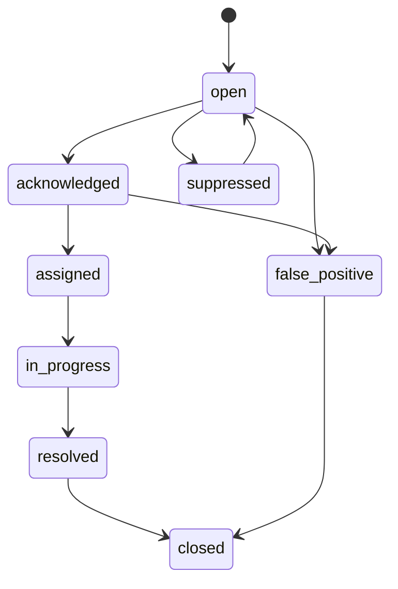
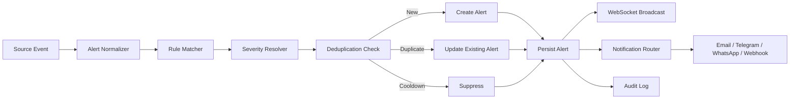

# 09_Alerting_Spec.md

# Alerting Specification
## Real Time Vessel Tracking System / VesselTrack OS

**Document Version:** 1.0  
**Status:** Draft  
**Date:** 2026-06-21  
**Owner:** Product & Engineering Team  
**Related Documents:**

- `01_PRD.md`
- `02_System_Architecture.md`
- `03_Data_Source_Strategy.md`
- `04_AIS_Data_Model.md`
- `05_Database_ERD.md`
- `06_API_Specification.md`
- `07_Realtime_WebSocket_Spec.md`
- `08_Geofence_Rule_Spec.md`

---

## 1. Purpose

Dokumen ini mendefinisikan spesifikasi **Alerting System** untuk aplikasi **Real Time Vessel Tracking System**.

Alerting System berfungsi sebagai lapisan pemberitahuan operasional yang mengubah kejadian teknis dan spasial menjadi sinyal tindakan untuk operator, supervisor, analyst, dan administrator.

Sistem alert harus mampu:

- Menerima event dari geofence, AIS processing, rule engine, dan system monitoring.
- Mengklasifikasikan alert berdasarkan severity.
- Menghindari alert berulang yang tidak berguna.
- Menyediakan lifecycle alert dari `open` sampai `resolved`.
- Mengirim alert ke dashboard real-time.
- Mengirim notifikasi eksternal seperti email, Telegram, WhatsApp Gateway, atau webhook.
- Menyimpan audit trail untuk kepentingan investigasi dan pelaporan.

---

## 2. Scope

### 2.1 In Scope

Dokumen ini mencakup:

1. Alert source.
2. Alert taxonomy.
3. Alert severity.
4. Alert lifecycle.
5. Alert rule processing.
6. Deduplication dan cooldown.
7. Notification routing.
8. Escalation policy.
9. Acknowledgement dan resolution.
10. Alert API.
11. Alert WebSocket event.
12. Database design.
13. Security dan RBAC.
14. Observability.
15. Testing dan acceptance criteria.

### 2.2 Out of Scope

Hal berikut tidak menjadi bagian dari dokumen ini:

- Implementasi detail vendor WhatsApp Gateway.
- SLA kontrak provider eksternal.
- Incident response procedure organisasi.
- Machine learning anomaly detection tingkat lanjut.
- Maritime regulatory enforcement workflow.

---

## 3. Alerting Principles

Sistem alert harus mengikuti prinsip berikut:

1. **Actionable**  
   Alert harus memberi informasi yang cukup agar operator dapat mengambil tindakan.

2. **Low Noise**  
   Alert berulang tanpa perubahan makna harus ditekan dengan deduplication dan cooldown.

3. **Traceable**  
   Setiap alert harus bisa ditelusuri ke event sumber, kapal, area, rule, dan timestamp.

4. **Real-Time First**  
   Alert kritikal harus muncul di dashboard melalui WebSocket dengan latency rendah.

5. **Human-in-the-Loop**  
   Operator harus dapat acknowledge, assign, comment, escalate, dan resolve alert.

6. **Configurable**  
   Severity, channel notifikasi, cooldown, dan escalation harus dapat dikonfigurasi.

7. **Auditable**  
   Semua perubahan status alert harus dicatat.

---

## 4. Alert Sources

Alert dapat berasal dari beberapa sumber.

| Source | Description | Example |
|---|---|---|
| `geofence_engine` | Event spasial dari geofence rule | Kapal masuk area terbatas |
| `ais_quality_engine` | Kualitas data AIS | Posisi loncat tidak realistis |
| `tracking_engine` | Status tracking kapal | AIS silence > 15 menit |
| `route_engine` | Deviasi jalur | Kapal keluar koridor rute |
| `speed_engine` | Pelanggaran kecepatan | Speed > 12 knot di zona labuh |
| `system_monitoring` | Kesehatan sistem | Ingestion service down |
| `manual_operator` | Alert dibuat manual oleh operator | Kapal dicurigai |
| `external_webhook` | Event dari sistem eksternal | Port authority notice |

---

## 5. Alert Taxonomy

### 5.1 Alert Types

| Alert Type | Code | Description |
|---|---|---|
| Geofence Enter | `GEOFENCE_ENTER` | Kapal masuk area tertentu |
| Geofence Exit | `GEOFENCE_EXIT` | Kapal keluar area tertentu |
| Restricted Area Breach | `RESTRICTED_AREA_BREACH` | Kapal masuk area terlarang |
| Dwell Time Violation | `DWELL_TIME_VIOLATION` | Kapal berada terlalu lama di area |
| Speed Violation | `SPEED_VIOLATION` | Kecepatan melebihi batas |
| AIS Silence | `AIS_SILENCE` | Data AIS tidak update dalam batas waktu |
| Position Jump | `POSITION_JUMP` | Perpindahan posisi tidak realistis |
| Route Deviation | `ROUTE_DEVIATION` | Kapal keluar dari koridor rute |
| Near Collision Risk | `NEAR_COLLISION_RISK` | Potensi kedekatan berbahaya antar kapal |
| Unknown Vessel | `UNKNOWN_VESSEL` | MMSI tidak dikenal atau belum terdaftar |
| Data Provider Error | `DATA_PROVIDER_ERROR` | Gangguan sumber data eksternal |
| System Error | `SYSTEM_ERROR` | Gangguan komponen aplikasi |
| Manual Alert | `MANUAL_ALERT` | Alert dibuat manual oleh operator |

### 5.2 Alert Categories

| Category | Description |
|---|---|
| `safety` | Berhubungan dengan keselamatan pelayaran |
| `security` | Berhubungan dengan area terbatas, kapal mencurigakan, atau pelanggaran |
| `operation` | Berhubungan dengan operasi pelabuhan, traffic, ETA, dan monitoring |
| `data_quality` | Berhubungan dengan kualitas data AIS |
| `system` | Berhubungan dengan kesehatan platform |

---

## 6. Severity Model

### 6.1 Severity Levels

| Severity | Numeric | Meaning | Example | Default Notification |
|---|---:|---|---|---|
| `critical` | 5 | Membutuhkan tindakan segera | Restricted area breach | Dashboard, WebSocket, Email, WhatsApp/Telegram |
| `high` | 4 | Risiko tinggi, perlu ditangani cepat | AIS silence kapal prioritas | Dashboard, WebSocket, Email |
| `medium` | 3 | Perlu perhatian operator | Speed violation ringan | Dashboard, WebSocket |
| `low` | 2 | Informasi operasional | Kapal masuk area monitoring | Dashboard |
| `info` | 1 | Notifikasi informatif | Kapal mulai bergerak | Dashboard optional |

### 6.2 Severity Assignment Rules

Severity ditentukan berdasarkan kombinasi:

- Alert type.
- Vessel priority.
- Geofence type.
- Time window.
- Rule threshold.
- Operational context.
- Escalation history.

Contoh:

```yaml
alert_type: RESTRICTED_AREA_BREACH
base_severity: critical
condition:
  geofence_type: restricted_area
  vessel_priority: any
notification:
  dashboard: true
  websocket: true
  email: true
  whatsapp: true
```

Contoh lain:

```yaml
alert_type: AIS_SILENCE
base_severity: medium
condition:
  silence_minutes: 15
severity_override:
  if_vessel_priority: high
  set_severity: high
```

---

## 7. Alert Lifecycle

### 7.1 Status

| Status | Description |
|---|---|
| `open` | Alert baru dibuat dan belum ditangani |
| `acknowledged` | Alert sudah dilihat/diakui oleh operator |
| `assigned` | Alert sudah ditugaskan ke user/tim tertentu |
| `in_progress` | Alert sedang ditangani |
| `suppressed` | Alert ditekan sementara karena cooldown/noise control |
| `resolved` | Masalah sudah selesai |
| `closed` | Alert ditutup setelah resolusi diverifikasi |
| `false_positive` | Alert dinyatakan tidak valid |

### 7.2 Lifecycle Flow



### 7.3 Status Transition Rules

| From | To | Actor/System | Rule |
|---|---|---|---|
| `open` | `acknowledged` | Operator | User has alert acknowledge permission |
| `acknowledged` | `assigned` | Operator/Supervisor | Assignee must be valid user/team |
| `assigned` | `in_progress` | Assignee | Work started |
| `in_progress` | `resolved` | Assignee/Supervisor | Resolution note required |
| `resolved` | `closed` | Supervisor/System | Verification completed or auto-close timeout |
| `open` | `suppressed` | System | Duplicate within cooldown window |
| `open` | `false_positive` | Operator/Supervisor | Reason required |

---

## 8. Alert Event Processing Flow



### 8.1 Processing Steps

1. Source event diterima.
2. Event dinormalisasi menjadi canonical alert candidate.
3. Rule engine menentukan apakah event layak menjadi alert.
4. Severity resolver menentukan tingkat urgensi.
5. Deduplication engine mengecek alert yang sama masih aktif atau tidak.
6. Alert baru dibuat atau existing alert diperbarui.
7. Alert disimpan ke database.
8. WebSocket mengirim update ke dashboard.
9. Notification router mengirim pemberitahuan eksternal sesuai rule.
10. Audit log dicatat.

---

## 9. Canonical Alert Model

### 9.1 Alert Object

```json
{
  "alert_id": "alt_01HZYK9W3V8P9FJ3T0M2Q7A1B4",
  "alert_type": "RESTRICTED_AREA_BREACH",
  "category": "security",
  "severity": "critical",
  "status": "open",
  "title": "Restricted area breach detected",
  "message": "MV Musi Jaya entered GF-01 Area Terbatas.",
  "vessel": {
    "mmsi": "525123456",
    "name": "MV Musi Jaya",
    "imo": "9876543",
    "vessel_type": "cargo"
  },
  "position": {
    "lat": -6.10231,
    "lon": 106.88012,
    "sog": 12.4,
    "cog": 88.5,
    "heading": 90,
    "timestamp": "2026-06-21T03:15:22Z"
  },
  "geofence": {
    "geofence_id": "gf_001",
    "name": "GF-01 Area Terbatas",
    "type": "restricted_area"
  },
  "rule": {
    "rule_id": "rule_restricted_enter_001",
    "rule_name": "Restricted Area Entry",
    "threshold": null
  },
  "source": "geofence_engine",
  "source_event_id": "evt_01HZYK9V",
  "dedup_key": "RESTRICTED_AREA_BREACH:525123456:gf_001",
  "first_seen_at": "2026-06-21T03:15:22Z",
  "last_seen_at": "2026-06-21T03:15:22Z",
  "occurrence_count": 1,
  "created_at": "2026-06-21T03:15:23Z",
  "updated_at": "2026-06-21T03:15:23Z"
}
```

### 9.2 Required Fields

| Field | Required | Description |
|---|---:|---|
| `alert_id` | Yes | Unique alert identifier |
| `alert_type` | Yes | Type code |
| `category` | Yes | Alert category |
| `severity` | Yes | Severity level |
| `status` | Yes | Lifecycle status |
| `title` | Yes | Short human-readable title |
| `message` | Yes | Operator-facing description |
| `source` | Yes | Source component |
| `first_seen_at` | Yes | First detection time |
| `last_seen_at` | Yes | Latest detection time |
| `dedup_key` | Yes | Key for duplicate control |

---

## 10. Deduplication Strategy

### 10.1 Purpose

Deduplication mencegah dashboard berubah menjadi pasar malam sirene. Event yang sama tidak boleh menciptakan ratusan alert identik.

### 10.2 Dedup Key Pattern

| Alert Type | Dedup Key Pattern |
|---|---|
| `GEOFENCE_ENTER` | `{alert_type}:{mmsi}:{geofence_id}` |
| `GEOFENCE_EXIT` | `{alert_type}:{mmsi}:{geofence_id}` |
| `RESTRICTED_AREA_BREACH` | `{alert_type}:{mmsi}:{geofence_id}` |
| `SPEED_VIOLATION` | `{alert_type}:{mmsi}:{geofence_id}:{speed_limit}` |
| `AIS_SILENCE` | `{alert_type}:{mmsi}` |
| `POSITION_JUMP` | `{alert_type}:{mmsi}` |
| `DATA_PROVIDER_ERROR` | `{alert_type}:{provider_name}` |
| `SYSTEM_ERROR` | `{alert_type}:{service_name}` |

### 10.3 Duplicate Handling

Jika alert dengan dedup key yang sama masih `open`, `acknowledged`, `assigned`, atau `in_progress`:

- Jangan buat alert baru.
- Update `last_seen_at`.
- Increment `occurrence_count`.
- Append event detail ke `alert_occurrences`.
- Broadcast `ALERT_UPDATED` via WebSocket.

### 10.4 New Alert Condition

Alert baru dibuat jika:

- Tidak ada active alert dengan dedup key sama.
- Alert sebelumnya sudah `resolved`, `closed`, atau `false_positive`.
- Cooldown sudah berakhir.
- Rule mengizinkan re-open.

---

## 11. Cooldown and Suppression

### 11.1 Default Cooldown

| Alert Type | Default Cooldown |
|---|---:|
| `GEOFENCE_ENTER` | 5 minutes |
| `GEOFENCE_EXIT` | 5 minutes |
| `RESTRICTED_AREA_BREACH` | 2 minutes |
| `SPEED_VIOLATION` | 10 minutes |
| `AIS_SILENCE` | 15 minutes |
| `POSITION_JUMP` | 10 minutes |
| `DATA_PROVIDER_ERROR` | 10 minutes |
| `SYSTEM_ERROR` | 5 minutes |

### 11.2 Suppression Rules

Suppression dapat terjadi jika:

- Alert identik muncul berkali-kali dalam cooldown window.
- Kapal berada di tepi geofence dan menghasilkan flapping enter/exit.
- Rule sedang dimatikan sementara oleh administrator.
- Vessel atau geofence dimasukkan dalam maintenance mode.

### 11.3 Suppressed Alert Record

Suppressed event tetap dicatat sebagai occurrence, tetapi tidak selalu dikirim sebagai notifikasi eksternal.

```json
{
  "alert_id": "alt_001",
  "suppressed": true,
  "suppression_reason": "duplicate_within_cooldown",
  "cooldown_until": "2026-06-21T03:25:00Z"
}
```

---

## 12. Notification Channels

### 12.1 Supported Channels

| Channel | MVP | Description |
|---|---:|---|
| Dashboard | Yes | Alert feed dalam aplikasi |
| WebSocket | Yes | Real-time push ke UI |
| Email | Yes | Email ke operator/supervisor |
| Telegram | Optional | Channel cepat untuk tim operasi |
| WhatsApp Gateway | Optional | Notifikasi eksternal via provider |
| Webhook | Optional | Integrasi sistem eksternal |
| SMS | Later | Untuk emergency fallback |

### 12.2 Notification Routing Matrix

| Severity | Dashboard | WebSocket | Email | Telegram/WhatsApp | Webhook |
|---|---:|---:|---:|---:|---:|
| `critical` | Yes | Yes | Yes | Yes | Optional |
| `high` | Yes | Yes | Yes | Optional | Optional |
| `medium` | Yes | Yes | Optional | No | Optional |
| `low` | Yes | Optional | No | No | No |
| `info` | Optional | Optional | No | No | No |

### 12.3 Notification Payload

```json
{
  "notification_id": "ntf_01HZYK9W",
  "alert_id": "alt_01HZYK9W3V8P9FJ3T0M2Q7A1B4",
  "channel": "email",
  "recipient": "operator@example.com",
  "subject": "CRITICAL: Restricted area breach detected",
  "body": "MV Musi Jaya entered GF-01 Area Terbatas at 2026-06-21 03:15:22 UTC.",
  "status": "queued",
  "created_at": "2026-06-21T03:15:23Z"
}
```

### 12.4 Message Template

#### Email Subject

```text
[{SEVERITY}] {ALERT_TYPE}: {VESSEL_NAME} / {MMSI}
```

#### Email Body

```text
Alert: {TITLE}
Severity: {SEVERITY}
Vessel: {VESSEL_NAME} ({MMSI})
Location: {LAT}, {LON}
Speed: {SOG} kn
Area: {GEOFENCE_NAME}
Detected At: {EVENT_TIME}

Open dashboard: {ALERT_URL}
```

#### WhatsApp / Telegram Short Message

```text
🚨 {SEVERITY}: {VESSEL_NAME} ({MMSI})
{TITLE}
Area: {GEOFENCE_NAME}
Speed: {SOG} kn
Time: {EVENT_TIME}
```

---

## 13. Escalation Policy

### 13.1 Escalation Triggers

Alert dapat dieskalasi jika:

- Critical alert tidak di-acknowledge dalam waktu tertentu.
- High alert tetap open melebihi SLA.
- Occurrence count meningkat cepat.
- Alert menyangkut vessel priority tinggi.
- Supervisor menekan tombol escalate manual.

### 13.2 Default Escalation SLA

| Severity | Acknowledge SLA | Escalation Target |
|---|---:|---|
| `critical` | 5 minutes | Supervisor + Admin |
| `high` | 15 minutes | Supervisor |
| `medium` | 60 minutes | Shift Lead |
| `low` | 1 day | No auto escalation |
| `info` | N/A | No escalation |

### 13.3 Escalation Event

```json
{
  "event_type": "ALERT_ESCALATED",
  "alert_id": "alt_001",
  "from_severity": "high",
  "to_severity": "critical",
  "reason": "not_acknowledged_within_sla",
  "escalated_to": ["supervisor", "admin"],
  "timestamp": "2026-06-21T03:20:23Z"
}
```

---

## 14. Database Design

### 14.1 Table: `alerts`

```sql
CREATE TABLE alerts (
    id UUID PRIMARY KEY DEFAULT gen_random_uuid(),
    alert_id TEXT UNIQUE NOT NULL,
    alert_type TEXT NOT NULL,
    category TEXT NOT NULL,
    severity TEXT NOT NULL,
    status TEXT NOT NULL DEFAULT 'open',
    title TEXT NOT NULL,
    message TEXT NOT NULL,

    mmsi TEXT,
    vessel_name TEXT,
    imo TEXT,
    geofence_id UUID,
    rule_id UUID,

    source TEXT NOT NULL,
    source_event_id TEXT,
    dedup_key TEXT NOT NULL,

    lat DOUBLE PRECISION,
    lon DOUBLE PRECISION,
    geom GEOGRAPHY(Point, 4326),
    sog DOUBLE PRECISION,
    cog DOUBLE PRECISION,
    heading DOUBLE PRECISION,
    event_time TIMESTAMPTZ NOT NULL,

    first_seen_at TIMESTAMPTZ NOT NULL,
    last_seen_at TIMESTAMPTZ NOT NULL,
    occurrence_count INTEGER NOT NULL DEFAULT 1,

    assigned_to UUID,
    acknowledged_by UUID,
    acknowledged_at TIMESTAMPTZ,
    resolved_by UUID,
    resolved_at TIMESTAMPTZ,
    resolution_note TEXT,

    metadata JSONB DEFAULT '{}'::jsonb,
    created_at TIMESTAMPTZ NOT NULL DEFAULT now(),
    updated_at TIMESTAMPTZ NOT NULL DEFAULT now()
);
```

### 14.2 Table: `alert_occurrences`

```sql
CREATE TABLE alert_occurrences (
    id UUID PRIMARY KEY DEFAULT gen_random_uuid(),
    alert_id UUID NOT NULL REFERENCES alerts(id) ON DELETE CASCADE,
    source_event_id TEXT,
    event_time TIMESTAMPTZ NOT NULL,
    lat DOUBLE PRECISION,
    lon DOUBLE PRECISION,
    geom GEOGRAPHY(Point, 4326),
    payload JSONB NOT NULL DEFAULT '{}'::jsonb,
    suppressed BOOLEAN NOT NULL DEFAULT false,
    suppression_reason TEXT,
    created_at TIMESTAMPTZ NOT NULL DEFAULT now()
);
```

### 14.3 Table: `alert_actions`

```sql
CREATE TABLE alert_actions (
    id UUID PRIMARY KEY DEFAULT gen_random_uuid(),
    alert_id UUID NOT NULL REFERENCES alerts(id) ON DELETE CASCADE,
    action_type TEXT NOT NULL,
    from_status TEXT,
    to_status TEXT,
    actor_user_id UUID,
    comment TEXT,
    metadata JSONB DEFAULT '{}'::jsonb,
    created_at TIMESTAMPTZ NOT NULL DEFAULT now()
);
```

### 14.4 Table: `alert_notifications`

```sql
CREATE TABLE alert_notifications (
    id UUID PRIMARY KEY DEFAULT gen_random_uuid(),
    alert_id UUID NOT NULL REFERENCES alerts(id) ON DELETE CASCADE,
    channel TEXT NOT NULL,
    recipient TEXT NOT NULL,
    subject TEXT,
    body TEXT NOT NULL,
    status TEXT NOT NULL DEFAULT 'queued',
    provider_message_id TEXT,
    retry_count INTEGER NOT NULL DEFAULT 0,
    last_error TEXT,
    sent_at TIMESTAMPTZ,
    created_at TIMESTAMPTZ NOT NULL DEFAULT now(),
    updated_at TIMESTAMPTZ NOT NULL DEFAULT now()
);
```

### 14.5 Indexes

```sql
CREATE INDEX idx_alerts_status ON alerts(status);
CREATE INDEX idx_alerts_severity ON alerts(severity);
CREATE INDEX idx_alerts_type ON alerts(alert_type);
CREATE INDEX idx_alerts_mmsi ON alerts(mmsi);
CREATE INDEX idx_alerts_geofence_id ON alerts(geofence_id);
CREATE INDEX idx_alerts_event_time ON alerts(event_time DESC);
CREATE INDEX idx_alerts_dedup_active ON alerts(dedup_key, status);
CREATE INDEX idx_alerts_geom ON alerts USING GIST (geom);
CREATE INDEX idx_alert_occurrences_alert_id ON alert_occurrences(alert_id);
CREATE INDEX idx_alert_occurrences_event_time ON alert_occurrences(event_time DESC);
CREATE INDEX idx_alert_notifications_status ON alert_notifications(status);
```

---

## 15. REST API Specification

Full API conventions mengikuti `06_API_Specification.md`.

### 15.1 List Alerts

```http
GET /api/v1/alerts
```

Query parameters:

| Parameter | Type | Description |
|---|---|---|
| `status` | string | Filter by status |
| `severity` | string | Filter by severity |
| `alert_type` | string | Filter by alert type |
| `mmsi` | string | Filter by vessel MMSI |
| `geofence_id` | string | Filter by geofence |
| `from` | datetime | Start event time |
| `to` | datetime | End event time |
| `limit` | integer | Page size |
| `cursor` | string | Pagination cursor |

Response:

```json
{
  "data": [
    {
      "alert_id": "alt_001",
      "alert_type": "RESTRICTED_AREA_BREACH",
      "severity": "critical",
      "status": "open",
      "title": "Restricted area breach detected",
      "vessel_name": "MV Musi Jaya",
      "mmsi": "525123456",
      "event_time": "2026-06-21T03:15:22Z",
      "last_seen_at": "2026-06-21T03:15:22Z",
      "occurrence_count": 1
    }
  ],
  "pagination": {
    "next_cursor": "eyJ..."
  }
}
```

### 15.2 Get Alert Detail

```http
GET /api/v1/alerts/{alert_id}
```

### 15.3 Acknowledge Alert

```http
POST /api/v1/alerts/{alert_id}/acknowledge
```

Request:

```json
{
  "comment": "Operator sudah melihat alert dan sedang memeriksa posisi kapal."
}
```

### 15.4 Assign Alert

```http
POST /api/v1/alerts/{alert_id}/assign
```

Request:

```json
{
  "assigned_to": "user_123",
  "comment": "Ditugaskan ke shift lead."
}
```

### 15.5 Resolve Alert

```http
POST /api/v1/alerts/{alert_id}/resolve
```

Request:

```json
{
  "resolution_note": "Kapal sudah keluar dari area terbatas dan dikonfirmasi aman."
}
```

### 15.6 Mark False Positive

```http
POST /api/v1/alerts/{alert_id}/false-positive
```

Request:

```json
{
  "reason": "Geofence polygon masih dalam proses kalibrasi."
}
```

### 15.7 Create Manual Alert

```http
POST /api/v1/alerts/manual
```

Request:

```json
{
  "mmsi": "525123456",
  "severity": "medium",
  "category": "operation",
  "title": "Kapal perlu dipantau",
  "message": "Operator melihat pergerakan tidak biasa dekat area labuh.",
  "lat": -6.10231,
  "lon": 106.88012
}
```

---

## 16. WebSocket Events

Full WebSocket conventions mengikuti `07_Realtime_WebSocket_Spec.md`.

### 16.1 Alert Created

```json
{
  "event": "ALERT_CREATED",
  "channel": "alerts",
  "timestamp": "2026-06-21T03:15:23Z",
  "data": {
    "alert_id": "alt_001",
    "alert_type": "RESTRICTED_AREA_BREACH",
    "severity": "critical",
    "status": "open",
    "title": "Restricted area breach detected",
    "message": "MV Musi Jaya entered GF-01 Area Terbatas.",
    "mmsi": "525123456",
    "vessel_name": "MV Musi Jaya",
    "lat": -6.10231,
    "lon": 106.88012,
    "event_time": "2026-06-21T03:15:22Z"
  }
}
```

### 16.2 Alert Updated

```json
{
  "event": "ALERT_UPDATED",
  "channel": "alerts",
  "timestamp": "2026-06-21T03:18:00Z",
  "data": {
    "alert_id": "alt_001",
    "status": "acknowledged",
    "acknowledged_by": "operator_001",
    "acknowledged_at": "2026-06-21T03:18:00Z"
  }
}
```

### 16.3 Alert Resolved

```json
{
  "event": "ALERT_RESOLVED",
  "channel": "alerts",
  "timestamp": "2026-06-21T03:40:00Z",
  "data": {
    "alert_id": "alt_001",
    "status": "resolved",
    "resolved_by": "operator_001",
    "resolution_note": "Kapal sudah keluar dari area.",
    "resolved_at": "2026-06-21T03:40:00Z"
  }
}
```

---

## 17. Frontend Requirement

### 17.1 Alert Feed

Dashboard harus menyediakan panel Alert Feed dengan:

- Severity badge.
- Alert type.
- Vessel name/MMSI.
- Geofence name bila tersedia.
- Event time.
- Status.
- Quick action: acknowledge.
- Link ke alert detail.

### 17.2 Alert Detail Page

Alert detail harus menampilkan:

- Ringkasan alert.
- Severity dan status.
- Vessel detail.
- Lokasi pada peta.
- Timeline occurrences.
- Action history.
- Notification history.
- Komentar operator.
- Tombol acknowledge, assign, resolve, false positive.

### 17.3 Map Integration

Alert pada peta harus memiliki:

- Marker khusus berdasarkan severity.
- Highlight vessel terkait.
- Highlight geofence terkait.
- Popup detail singkat.
- Link ke alert detail.

### 17.4 Notification UX

Untuk alert `critical` dan `high`:

- Toast notification muncul di UI.
- Bunyi notifikasi opsional berdasarkan user setting.
- Alert feed otomatis naik ke paling atas.
- Marker peta berkedip atau diberi pulse effect secara terbatas.

---

## 18. RBAC

| Action | Admin | Supervisor | Operator | Analyst | Viewer |
|---|---:|---:|---:|---:|---:|
| View alerts | Yes | Yes | Yes | Yes | Yes |
| Acknowledge alerts | Yes | Yes | Yes | No | No |
| Assign alerts | Yes | Yes | No | No | No |
| Resolve alerts | Yes | Yes | Yes | No | No |
| Mark false positive | Yes | Yes | No | No | No |
| Create manual alert | Yes | Yes | Yes | No | No |
| Configure alert rules | Yes | No | No | No | No |
| Configure notification channels | Yes | No | No | No | No |
| Export alert report | Yes | Yes | Yes | Yes | No |

---

## 19. Security Requirements

1. Semua alert API wajib menggunakan authenticated session/token.
2. Action endpoint wajib dicek berdasarkan role.
3. Semua perubahan status alert wajib masuk audit log.
4. Notification recipient harus divalidasi.
5. Webhook notification harus menggunakan signature.
6. Sensitive provider credential tidak boleh muncul dalam alert metadata.
7. Alert export harus mengikuti access control.
8. Rate limit diterapkan pada manual alert creation.

---

## 20. Observability

### 20.1 Metrics

Sistem harus mencatat metrik:

| Metric | Description |
|---|---|
| `alerts_created_total` | Jumlah alert dibuat |
| `alerts_by_severity` | Jumlah alert per severity |
| `alerts_open_total` | Jumlah alert aktif |
| `alerts_ack_latency_seconds` | Waktu dari open ke acknowledge |
| `alerts_resolution_latency_seconds` | Waktu dari open ke resolved |
| `alert_notifications_sent_total` | Jumlah notifikasi terkirim |
| `alert_notifications_failed_total` | Jumlah notifikasi gagal |
| `alert_suppressed_total` | Jumlah alert/event ditekan |
| `alert_dedup_hits_total` | Jumlah duplicate event |

### 20.2 Logs

Log minimal:

```json
{
  "level": "info",
  "service": "alert-engine",
  "message": "alert_created",
  "alert_id": "alt_001",
  "alert_type": "RESTRICTED_AREA_BREACH",
  "severity": "critical",
  "mmsi": "525123456",
  "dedup_key": "RESTRICTED_AREA_BREACH:525123456:gf_001",
  "timestamp": "2026-06-21T03:15:23Z"
}
```

### 20.3 Dashboard Monitoring

Admin dashboard harus menampilkan:

- Alert volume per hour.
- Open alert count.
- Notification failure rate.
- Top alert type.
- Top vessel with alerts.
- Top geofence with alerts.
- Average acknowledgement time.
- Average resolution time.

---

## 21. Performance Requirements

| Requirement | Target MVP |
|---|---:|
| Event-to-alert creation latency | < 2 seconds |
| Alert WebSocket delivery | < 1 second after creation |
| Alert list API response | < 500 ms for typical query |
| Critical notification dispatch | < 10 seconds |
| Deduplication check | < 100 ms |
| Alert feed refresh | Real-time via WebSocket |

---

## 22. Failure Handling

### 22.1 Notification Failure

Jika notifikasi eksternal gagal:

1. Status notification menjadi `failed`.
2. Error disimpan di `last_error`.
3. Retry dilakukan sesuai retry policy.
4. Jika tetap gagal, alert tetap tampil di dashboard.
5. Failure notification dapat dikirim ke admin channel.

### 22.2 Retry Policy

| Attempt | Delay |
|---:|---:|
| 1 | Immediate |
| 2 | 1 minute |
| 3 | 5 minutes |
| 4 | 15 minutes |
| 5 | Stop / mark failed |

### 22.3 WebSocket Failure

Jika WebSocket gagal:

- Client melakukan reconnect.
- Client memanggil `GET /api/v1/alerts?status=open` untuk sinkronisasi ulang.
- Server tidak wajib menyimpan per-client event queue pada MVP.

---

## 23. Retention Policy

| Data | MVP Retention | Notes |
|---|---:|---|
| Active alerts | Until closed | Tetap tersedia di dashboard |
| Closed alerts | 1 year | Untuk audit dan reporting |
| Alert occurrences | 1 year | Bisa dipartisi bulanan |
| Notification logs | 6 months | Cukup untuk investigasi |
| Alert action logs | 2 years | Audit trail lebih panjang |

---

## 24. Configuration Model

### 24.1 Alert Rule Configuration

```json
{
  "rule_id": "rule_speed_001",
  "alert_type": "SPEED_VIOLATION",
  "enabled": true,
  "severity": "medium",
  "cooldown_seconds": 600,
  "threshold": {
    "speed_knots": 12,
    "duration_seconds": 60
  },
  "notification_channels": ["dashboard", "websocket"],
  "escalation": {
    "enabled": true,
    "ack_sla_seconds": 3600
  }
}
```

### 24.2 Channel Configuration

```json
{
  "channel": "email",
  "enabled": true,
  "recipients": [
    "operator@example.com",
    "supervisor@example.com"
  ],
  "severity_filter": ["critical", "high"],
  "quiet_hours": null
}
```

---

## 25. Testing Strategy

### 25.1 Unit Tests

- Severity resolver.
- Dedup key generator.
- Cooldown evaluator.
- Alert lifecycle transition validator.
- Notification template renderer.

### 25.2 Integration Tests

- Geofence event creates alert.
- Duplicate event updates existing alert.
- Critical alert sends notification.
- Acknowledge endpoint changes status.
- Resolve endpoint records audit log.
- WebSocket receives `ALERT_CREATED`.

### 25.3 Load Tests

Minimum scenario:

- 1,000 vessel updates/minute.
- 100 alerts/minute.
- 50 concurrent dashboard clients.
- Alert API p95 response < 500 ms.

### 25.4 User Acceptance Tests

- Operator melihat alert baru di dashboard.
- Operator acknowledge alert.
- Supervisor assign alert.
- Operator resolve alert.
- Alert detail menampilkan timeline dan peta.
- Critical alert mengirim email/Telegram/WhatsApp sesuai konfigurasi.

---

## 26. Acceptance Criteria

Sistem alert dianggap memenuhi MVP jika:

1. Alert dapat dibuat otomatis dari geofence rule.
2. Alert dapat dibuat otomatis dari AIS silence rule.
3. Alert muncul di dashboard real-time via WebSocket.
4. Alert memiliki severity, status, vessel, lokasi, dan timestamp.
5. Operator dapat acknowledge alert.
6. Operator atau supervisor dapat resolve alert.
7. Duplicate alert tidak menciptakan spam.
8. Critical alert dapat memicu minimal satu notifikasi eksternal.
9. Semua action alert masuk audit log.
10. Alert API mendukung filter status, severity, type, vessel, dan date range.
11. Alert detail menampilkan occurrence history.
12. RBAC diterapkan untuk action penting.

---

## 27. MVP Implementation Backlog

| Priority | Item | Description |
|---|---|---|
| P0 | Alert table migration | Buat tabel `alerts`, `alert_occurrences`, `alert_actions`, `alert_notifications` |
| P0 | Alert engine service | Service untuk menerima event dan membuat alert |
| P0 | Deduplication engine | Dedup key dan cooldown |
| P0 | Alert REST API | List, detail, acknowledge, resolve |
| P0 | Alert WebSocket event | Broadcast alert created/updated/resolved |
| P0 | Alert feed UI | Panel alert pada dashboard |
| P1 | Email notification | Kirim email untuk severity high/critical |
| P1 | Escalation timer | Escalate critical/high jika tidak di-ack |
| P1 | Manual alert | Operator membuat alert manual |
| P1 | Alert detail page | Timeline, map, action history |
| P2 | Telegram/WhatsApp gateway | Channel tambahan |
| P2 | Webhook integration | Integrasi sistem eksternal |
| P2 | Analytics alert | Statistik alert dan SLA |

---

## 28. Open Questions

1. Channel notifikasi eksternal mana yang menjadi prioritas MVP: email, Telegram, atau WhatsApp Gateway?
2. Apakah ada shift operation dan struktur eskalasi nyata?
3. Apakah alert perlu mengikuti jam kerja atau 24/7?
4. Apakah semua vessel sama penting, atau perlu vessel priority?
5. Apakah critical alert boleh auto-escalate ke pihak eksternal?
6. Berapa retention final untuk closed alert?
7. Apakah perlu integrasi dengan ticketing system seperti Jira, ServiceNow, atau sistem internal?

---

## 29. Summary

`09_Alerting_Spec.md` mendefinisikan fondasi alerting untuk **Real Time Vessel Tracking System**.

Alerting System bertindak sebagai jembatan antara data real-time dan tindakan manusia. Tanpa alerting yang rapi, peta hanya menjadi layar cantik. Dengan alerting yang matang, sistem berubah menjadi ruang kendali yang bisa memandu operasi: tahu kapan kapal masuk area kritikal, kapan sinyal hilang, kapan kecepatan melanggar batas, dan siapa yang harus merespons.

Untuk MVP, fokus utama adalah:

1. Alert dari geofence.
2. Alert dari AIS silence.
3. Alert dashboard real-time.
4. Deduplication dan cooldown.
5. Acknowledge dan resolve.
6. Notification eksternal minimal untuk alert high/critical.
7. Audit trail untuk semua action.

---

**End of Document**
